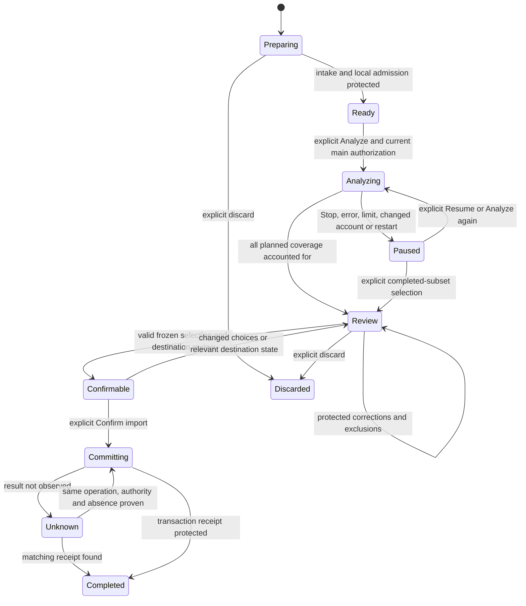

# Project import v1 — IM01 design contract

Current implementation: IM02–IM07 supply [sessions](import-sessions-v1.md), [intake](import-intake-v1.md), [graphs](import-graph-v1.md), [external transcripts](external-conversations-v1.md), [source/note origins](imported-content-v1.md) and [one protected ChatGPT analysis request](import-analysis-v1.md). SQL/minimum reader is **26**. The original design below remains normative for later multi-part/review/acceptance stages; it does not establish their implementation or user acceptance.

October 9, 2026. **Normative design; consult the stage-specific contracts above for installed behavior.** Applies to the approved [import plan](../../import-implementation-plan.md) and [IM01 decision](../decisions/import-IM01.md). Later stages implement only their assigned portion and record actual schema/operation versions. The concrete schema-22 records, IPC and preservation consumers are defined in [Import sessions v1](import-sessions-v1.md). General partitioning, proposal editing and acceptance below remain future-stage design. IM07 installs only a bounded single-request adapter; live provider capability and native acceptance remain unconfirmed.

## 1. Scope and terms

An **import batch** belongs to one already-created project. Its candidate content is AI chats, Sources & research and/or Notes from explicitly selected JSON, UTF-8 text/Markdown, CSL-JSON, BibTeX or RIS. A batch never creates a project or replaces manuscript writing. It may be prepared while offline; fresh AI analysis requires the existing eligible ChatGPT connection. Protected analysis can be reviewed and accepted offline when local project access permits.

**Staged** means protected project data awaiting review, not visible accepted content. **Analyzed** means a part received a terminal, locally valid and protected proposal. **Accepted** means an exact user-confirmed graph transaction has an import receipt. **Saved** means the existing explicit selected-file Save completed. None implies another.

Imports retain whole originals. Excluding a record from transmission or acceptance does not remove its bytes from an original or previous saved/retained project version. Initial v1 offers no selected-content-only retention, URL fetch, neighbor-file resolution, archive unpacking, binary reader, OCR or external project dependency.

## 2. Ownership and version boundaries

| Owner                                                                      | Responsibility                                                                                                                                                   |
| -------------------------------------------------------------------------- | ---------------------------------------------------------------------------------------------------------------------------------------------------------------- |
| Renderer retained import controller, under existing workspace/draft owners | Selection intent, user edits, presentation, focus and exact pending commands; never raw path, account or SQL authority                                           |
| Main import service/native picker                                          | Trusted sender and project/workspace binding, file grants, byte-intake orchestration, ephemeral analysis and confirmation authorizations, lifecycle coordination |
| Existing `AiService` / `DirectPlanSession` / `AiContentService`            | Same account/catalog/route, prepared request, encrypted local execution, Stop, output protection, recovery, settlement and handoff                               |
| Existing serial worker/project owner                                       | Staging, parsing, immutable artifacts, authoritative graph/coverage/reviews, duplicate reads, transactional acceptance and portable receipts                     |
| Existing snapshot/Save/access/retention owners                             | Version admission, leases, retained-copy migration, file publication, copy/rekey, entitlement and refusal of unsafe removal                                      |

Do not start another auth stack or durable provider queue. Add a typed import content adapter to the shared lifecycle so conversation/proofreading retain their behavior and versions. Candidate graphs are excluded from ordinary conversation context, search results, sources, notes and compilation until acceptance.

**IM01 baseline inspected:** SQL/minimum reader 21; archive/editor 1; conversation record 2; live message 1; capture 5; direct journal/binding 6; handoff receipt 1. Preserve all prior schemas, strict readers, immutable request bytes and digests. New import envelopes begin at their own `version: 1`. New SQL floors, live transcript/capture versions and direct/handoff versions are allocated from the checkout in the implementing stage, not assumed from this design.

## 3. Identities, encodings and digests

- New batch, file, artifact, record, relationship, part, attempt, proposal, review, receipt and accepted-entity IDs use Collie's UUID policy. IDs are opaque and persist independently of list order, filenames, titles or timestamps. Workspace/project routing IDs appear on commands/outer SQL ownership, not inside immutable evidence bodies.
- External identity is `{originNamespace, entityKind, externalConversationId, externalId}`. Optional external fields are explicitly null. Preserve the original string; never force an external ID to satisfy the internal UUID validator. Record IDs, mapping-node IDs and provider message IDs are distinct. Where external identity is absent, use a file-hash/locator identity and require review before matching another file.
- Original file digests are SHA-256 of exact bytes. Structured digests use the canonical JSON ordering implemented by `src/worker/storage/digest.ts`: sorted object keys, unchanged array order, SHA-256 over UTF-8 canonical JSON. Reject unsupported JSON values rather than coerce them. Each new digest includes a domain label and contract version.
- File decoding is strict UTF-8, optionally with an initial BOM recorded as a decode fact. Preserve original bytes, line endings and Unicode normalization. Do not silently replace invalid byte sequences. Source JSON numeric timestamps retain their raw lexical value where needed for precision, even when a normalized display time can be derived.
- JSON locators contain the original file ID/hash and a bounded RFC 6901 pointer to a value. Reject duplicate JSON object keys before interpretation; ambiguous last-key-wins parsing cannot establish provenance. A pointer is data, never evaluated code. Text locators identify a decoded field/part plus `[start, end)` UTF-16 offsets and an exact field digest; never split surrogate pairs. Byte offsets, decoded offsets and rendered Markdown offsets are not interchangeable.
- Display cleanup has its own version and mapping to the canonical text variant. Source references lacking a provable inline span stay message-level. Neither a cleaned marker position nor an AI-suggested quotation becomes a verified source offset.
- `createdAt` on Collie records is a valid UTC instant for the local event. Imported historical time is `{raw, normalizedUtc, precision, zoneKnown}` with nullable fields. Missing or invalid historical time stays unknown and does not inherit import time. Preserve known sequence/parent order over timestamp sorting.

## 4. Frozen v1 bounds

These are local application limits, not provider token/context guarantees. All limits compose with existing destination, archive, database, access and retention constraints; the smaller applicable admission bound wins. Raising a bound requires a documented contract revision and corresponding consumers, not a broad global AI-limit increase.

| Resource                                    | V1 maximum / rule                                                                                                                                                                                                                     |
| ------------------------------------------- | ------------------------------------------------------------------------------------------------------------------------------------------------------------------------------------------------------------------------------------- |
| Selected files                              | 100 per batch; repeated Add files counts toward the same total                                                                                                                                                                        |
| Original bytes                              | 25 MiB per file; 100 MiB per batch, counting selected entries even when blobs deduplicate                                                                                                                                             |
| Decoded/extracted text and metadata         | 20,000,000 UTF-16 units per batch; excluded raw reasoning does not consume AI coverage, but raw intake/parser byte limits still apply                                                                                                 |
| JSON parser                                 | Depth 64; 1,000,000 total values/object members across selected files; 2,000,000 UTF-16 units per decoded string; duplicate keys and non-finite numbers refused                                                                       |
| Logical records and relations               | 50,000 records, 100,000 relations per batch, including retained-only graph records; file-level excluded subtrees may be summarized by locator/count without materializing their contents                                              |
| Individual accepted transcript/note text    | Up to 1,000,000 UTF-16 units in referenced immutable text; note AST and destination field limits may be smaller; preserve and report anything not representable                                                                       |
| Optional instructions / destination context | 4,000 / 4,000 UTF-16 units respectively; context is title/type/description and disclosed bounded candidates, not automatic manuscript/history                                                                                         |
| Input packet                                | At most 60,000 UTF-16 units and 240,000 UTF-8 bytes after packet serialization; at most 128 record fragments and 256 relation references; final wire framing has its separate check below                                             |
| Wire request                                | At most 80,000 UTF-16 units and 320,000 UTF-8 bytes including serialized instructions, schema description and framing; keep existing transport limits if stricter                                                                     |
| Proposal result                             | At most 128,000 UTF-16 units and 512,000 UTF-8 bytes; at most 128 entity suggestions, 256 links, 128 issues and 128 coverage entries; each field bounded by its destination contract                                                  |
| Local structured artifact                   | Page bodies at most 1 MiB; artifact descriptors at most 64 KiB; large graph/review manifests reference ordered pages rather than embedding all contents in one SQL value                                                              |
| Protected derived import artifacts          | At most 256 MiB per batch across extraction, captures, results and retained review versions, excluding original blobs and accepted domain rows; count logical references conservatively even if bytes deduplicate                     |
| Durable batch catalog                       | 1,000 total batches per project; at most 8 nonterminal batches per workspace; 1,000 state/review revisions per batch. Refuse new revisions at capacity; never evict originals or prior accepted history                               |
| Provider plan                               | One request at a time; at most 64 requests per explicit authorization and 1,024 actual analysis attempts per batch across all continuations. Reserve capacity before dispatch and retain a terminal write slot                        |
| Review/read pages                           | 50 rows; at most 100,000 UTF-16 units total per IPC page; long bodies use explicit bounded slices with total length and continuation                                                                                                  |
| Display labels                              | File basenames 255 units, import instructions 4,000; use stricter existing conversation/source/note title and URL limits at acceptance; retain an overlong original value as provenance and require an explicit shorter display value |

Terminal settlement, Stop, exact retry and receipt lookup must remain possible at capacity. Reserve their descriptor/output budget when admitting work. Model output that exceeds reserved bounds fails as `output-limit`; retain the bounded received prefix as a failed/partial attempt, never a usable proposal. If user edits need another revision beyond capacity, retain the existing review and refuse that edit with a clear limit; do not discard the only copy.

The existing 64 retained AI-operation slots are separate from the 64-request authorization ceiling. Settle each part through the worker and acknowledge the exact handoff before releasing its slot. Do not preallocate an entire batch's requests, auto-dismiss failed outcomes or delete retained operation files to make room.

Use worker volume budgets for originals, derived blobs, SQLite growth, WAL/temporary writes, migration candidates, snapshots and expanded archive validation. The current archive admits 100,000 entries, 1 GiB per blob and 4 GiB database images; that is not permission to hit those limits when smaller consumers apply. Current removal proofs read at most a 32 MiB database and full-content digests stop at 200,000 rows/128 MiB of serialized row material. Larger imports must not silently bypass those proofs or imply their data is disposable. V1 conservatively refuses working-copy removal for import-bearing projects.

The approved corpus fits the raw-byte bounds on the plan's dated inventory. This is not a runtime memory, latency or provider-capacity result. Derive part counts from the selected bytes at intake; never promise that every corpus fits one authorization window.

## 5. Portable records and storage layout

Use the existing content-addressed `blobs/<sha256>` inventory and leases for immutable originals and large artifacts. Register them through managed asset ownership so `readPortableGraph` includes every authoritative byte, even if no accepted source or note references it yet. Blob hashes are not filenames supplied by the input. Original selected names are metadata; any invalid managed-asset basename is replaced by a safe internal basename while the original remains in bounded provenance.

These are required logical table families/record fields. Implement exact DDL and indexes in the owning stage; every family uses outer `project_id`, a strict version reader, bounded SQL reads and matching foreign keys/portable graph checks. Body shapes below use explicit nulls/empty arrays and reject unknown contract keys. Unknown **input** fields remain in originals/provenance; they do not relax the contract schema.

| Record family / owner stage             | Required fields and invariants                                                                                                                                                                                                                                                                                         |
| --------------------------------------- | ---------------------------------------------------------------------------------------------------------------------------------------------------------------------------------------------------------------------------------------------------------------------------------------------------------------------- |
| `import_batches` / IM02                 | `id`, `currentRevisionId`, `createdAt`; one explicit current revision with same-batch membership, never latest row order. Current phase is read from that revision                                                                                                                                                     |
| `import_batch_revisions` / IM02         | `id`, `batchId`, `parentRevisionId`, `phase`, `selectedFileIds`, sorted unique `categories`, `instructions`, `retention: whole-originals`, current graph/plan/proposal/review/receipt IDs or null, `createdAt`, `digest`; append-only                                                                                  |
| `import_files` / IM02–IM03              | `id`, `batchId`, `assetId`, `originalName`, `sha256`, `bytes`, declared/detected media type, selected order, intake facts/time; immutable after protected intake. Same bytes may have multiple file entries but one managed blob                                                                                       |
| `import_artifacts` / IM02               | `id`, `batchId`, typed `kind`, `contractVersion`, ordered managed blob page references with hashes/lengths, total bytes, digest, creation time. Admit only kinds whose strict readers are actually implemented at that schema floor; later kinds require updated admission, never generic JSON trust                   |
| Input graph / IM04                      | Graph revision, ordered record pages and relation pages, files/readers/decoder versions, scope-independent digest, coverage totals. Records have `recordId`, kind, external identity, exact locators, text variant refs, raw metadata refs and visibility/analysis eligibility                                         |
| Graph relationships / IM04              | `relationId`, kind, `fromRecordId`, `toRecordId` or retained-only locator target, exact input evidence and original decision/grade when present. Same-batch referential integrity; no implicit cross-file access                                                                                                       |
| Imported conversation provenance / IM05 | Accepted `conversationId`, batch/receipt identity, original thread/variant/path identity, external fields/times/flags and display policy. Existing conversation metadata remains the normal list/archive owner                                                                                                         |
| Imported messages / IM05                | `id`, `revisionId`, `conversationId`, imported segment/order key, raw message/node identities, normalized role plus original role/participant, text variant/content ref, historical time, origin locator. No `attemptId` or dispatch binding                                                                           |
| Imported source/note provenance / IM06  | Accepted source/note ID where present, exact origin record/locator, metadata/author origin, prior decision/grade/labels, source occurrence identity and accepted relation IDs. Rejected-only occurrences may have no source row                                                                                        |
| Analysis plan and parts / IM07–IM08     | Plan ID/revision, graph/settings digest, ordered part IDs and dependencies; each part has immutable capture ID/digest, input fragment refs, expected coverage and output budget. Mutable progress is an explicit revision/selecting attempt, not overwriting original input                                            |
| Import analysis attempts/results / IM07 | Attempt ID, part/capture IDs, ordinal within part, actual model and safe provider/template names, outcome, complete result or partial artifact reference, validation report, result digest/time and current chosen valid result ID. No account subject/token/fingerprint, workspace or dispatch grant in portable body |
| Proposal/review revisions / IM08–IM09   | ID, batch/graph/analysis-result digest set, parent revision, proposed entity/relationship page refs, every coverage outcome, original/suggested/corrected values and user choices; explicit current selector in batch revision                                                                                         |
| Commit manifest / IM09–IM10             | Batch/review identity, selected graph digest, planned internal IDs/actions, source candidate identity/revision snapshot, current target revisions/head, preallocated receipt ID, counts and canonical digest. No provider authority                                                                                    |
| `import_receipts` / IM10                | Immutable receipt ID, batch ID, operation ID, manifest/review digests, accepted/reused/excluded identity map artifact, counts, before/after heads and commit time. Same operation/request returns this receipt exactly                                                                                                 |

The import-artifact catalog is not a back door for arbitrary files: each kind has a known reader, page order, total/hash agreement and cross-reference validator. Graph, message and proposal bodies may use blobs to avoid copying long text into every SQL row. Snapshot admission must validate their semantic references through a bounded worker artifact-read phase as well as checking SQLite and blob hashes. Do not assume the current SQL-only `readPortableGraph` already performs those checks.

Use one authoritative representation for each value: selectors live in batch/attempt metadata, immutable content in typed artifacts, and accepted mutable domain records in their ordinary owners. Reconstructed caches/previews may be rebuilt; raw bytes, graph provenance, selected variants, results and review decisions cannot.

## 6. Input interpretation and metadata disposition

| Input fact                                              | Normal visible/import behavior                                                                                                              | AI payload/context treatment                                                                                                              |
| ------------------------------------------------------- | ------------------------------------------------------------------------------------------------------------------------------------------- | ----------------------------------------------------------------------------------------------------------------------------------------- |
| Explicit user/assistant text                            | Preserve exact text and order; map `You`/`LLM` only through the recognized adapter                                                          | Eligible as quoted historical data with role labels; never live system instructions                                                       |
| Multiple consecutive same-role messages                 | Keep separate message IDs and sequence positions                                                                                            | Keep separate fragments/records, not artificial paired turns                                                                              |
| `thoughts`, `reasoning_recap`, hidden/internal records  | Retain only in original; show excluded category/count in the report without ordinary transcript expansion                                   | Excluded from import analysis and automatic chat context                                                                                  |
| Exported system/developer/tool/unknown roles            | Retain exact original role; preview as labeled external material only; default excluded from ordinary transcript unless explicitly reviewed | Never provider system/developer role. Unknown content stays excluded until the user identifies a supported interpretation                 |
| Complete parent graph + `current_node`                  | Selected path is the reversed parent chain; missing parents/cycles/contradictory IDs block the affected path                                | Supply path evidence and admitted visible records; no whole reasoning tree                                                                |
| Message arrays without envelope/branch evidence         | Preserve array sequence as an observed order, correlate selected sibling files by IDs/content, or ask in review                             | No invented parent links, missing chat ID or inferred “all branches complete” claim                                                       |
| Curated aggregate / thread inventory                    | Split by explicit thread IDs; resolve missing per-message IDs only from unambiguous envelope/identity evidence                              | The aggregate wrapper is not one chat and the global `turn_index` is not a thread identity                                                |
| Dates / participants / titles                           | Preserve raw and normalized values separately; unknowns remain unknown                                                                      | Bound supplied metadata; classification cannot invent history                                                                             |
| Archive / no-recall flags                               | Preserve original flags; honor recognized archived/exclusion intent in default active/context behavior                                      | Opening/importing never resets no-recall intent. Explicit user changes remain reviewable                                                  |
| Kept/rejected reference / grade                         | Preserve per-message occurrence, original URL, attribution and decision. Grades remain imported annotations                                 | Kept reference metadata can propose Research; rejected-only occurrences stay retained provenance; attribution is not automatically author |
| Raw citation / search candidate / snippet               | Keep distinct occurrence kinds; no inline span without exact evidence                                                                       | Search snippets are labeled snippets, not inspected article passages                                                                      |
| Images / widgets / missing attachments / external paths | Report unsupported or unavailable, keep inert original metadata; never fetch                                                                | Exclude image/widget payloads and attachment contents absent from selection                                                               |
| Categories / tags / source-note links                   | Preserve recorded labels/relationships; propose normalized labels with provenance                                                           | Suggestions remain separate from original input facts                                                                                     |
| Unknown fields                                          | Retain exact original and locator; show relevant fields in optional details                                                                 | Only bounded disclosed fields enter a payload; no arbitrary instruction/secret/log ingestion                                              |

If a required original string exceeds the parsing or accepted-field bound, report the affected record and preserve bytes; do not silently truncate. A shorter user-approved title/display label does not rewrite its source value. Metadata-only sources stay unverified. No inferred quote becomes an inspection excerpt, no exported grade becomes an evidence assessment, and no manuscript citation is inserted during acceptance.

### Recognition and duplicate precedence

Local extraction establishes file integrity, identity, structural order and exact values. Curated decisions supplement raw evidence; raw search metadata cannot overwrite a kept/rejected decision. Raw and curated body variants may legitimately differ due to display cleanup. Preserve both and show the chosen variant in review; substantive conflicts require a choice.

Deduplicate identical selected file bytes locally. Within a batch, correlate complete/raw/array views using exact external identities and content evidence; never filenames alone. Across imports, consult accepted external identity/variant mappings before proposing new entities. Same identity and same accepted content defaults to already imported; changed content is a conflict, not an overwrite.

V1 repeat imports offer **Skip**, **Use existing** where valid, or an explicitly separate variant/conversation. They do not splice a newly discovered historical tail into a chat that already contains native replies. Incremental synchronization and automatic tail append are deferred. A wholly recognized no-op can finish locally with a truthful no-op report; any material proposed for acceptance through this workflow must pass actual ChatGPT analysis.

## 7. State, revisions and authority

The diagram is a logical state model, not executable code. Ready/Paused/Confirmable can also be explicitly discarded after settling all active/unknown work. A rejected new commit returns to review with its reason; an ambiguous one stays Unknown. A modal opening/closing never changes these authorities.

Batch revisions are append-only and include previous/current IDs. An identical operation returns the existing revision without another head advance. Revision and source-candidate checks happen inside the worker transaction. Protect a revision before acknowledging it to renderer; retain exact uncertain writes in the existing draft owner.

Staging, review changes and result settlement advance ordinary project bookkeeping/head so Save captures them. They never replace the editor payload or editor epoch. The AI capture binds immutable input graph/settings, not a constantly advancing project head. Editing instructions/files/category choices pauses the plan and requires new analysis for changed coverage; review-only title/metadata edits do not regenerate AI output.

For final confirmation, flush retained writing/forms first, freeze selected decisions, compare relevant destination source/entity revisions and capture the resulting current head. Serial main/worker ownership admits that exact manifest. A competing mutation before transaction admission returns stale with no writes. Local re-admission can refresh unchanged semantic choices against a new head without inference, but requires another explicit confirmation; do not automatically rebase and commit under an old click. Identical receipt replay ignores later head advances after proving the same original request.

### Ephemeral grants

**Analysis authorization** is main-only: current scope/sender ownership, batch/graph/settings/plan digests, ordered remaining parts, account fingerprint/session/catalog/review stamp/model, template digest, request ceiling, used count and cancellation generation. It is never serialized into portable state or treated as a renderer checkbox. Reserving a part consumes a local authorization slot before possible dispatch; refusal can conservatively count against the bound. Actual sent-attempt counts are retained separately.

Only never-dispatched parts in that authorized plan can advance automatically. Stop latches cancellation before aborting HTTP; a racing terminal result can be protected but cannot start another part. Local abort does not prove remote cancellation or refunded usage. Main restart/renderer ownership loss suspends future dispatch; a still-owned response may finish protection under the existing recovery rules.

**Confirmation authorization** is separately main-owned and scoped to the exact manifest/destination/owner generation. Reopen/copy recovers a manifest for inspection but not its grant. New copies need fresh access/current head checks and confirmation. Local same-operation retry after uncertainty never changes the manifest or planned IDs.

Protection failure is an independent overlay: retain the last protected revision plus the exact pending write; show Retry local protection and block transitions that abandon it. Review/dismissal does not acknowledge unresolved execution. No auto-eviction or automatic reanalysis.

## 8. Narrow command surface

All commands use existing trusted-frame/access validation and exact typed IPC. Read/status commands confer no mutation or inference authority. Mutation requests carry an operation ID plus expected revision where relevant; the worker computes the canonical request digest. The following names describe required actions, not endpoints already implemented.

| Action                                   | Boundary and required behavior                                                                                                                                  |
| ---------------------------------------- | --------------------------------------------------------------------------------------------------------------------------------------------------------------- |
| Create/list/read batch                   | Exact project/workspace acquisition; paged summaries; create requires writable access, reads remain available under ordinary recovery/read policy               |
| Add files                                | Main native multi-picker → immutable staged files; renderer sends no path. Confirm the source descriptor/size/hash remained stable during intake                |
| Change selection/instructions/categories | New protected batch revision; pause a conflicting analysis plan; do not delete retained versions                                                                |
| Prepare/read local graph                 | Worker reads only staged assets with known readers; produces coverage and bounded previews; no provider call                                                    |
| Prepare analysis disclosure              | Exact transmitted record/fragment manifest, destination context and planned request ceiling; unavailable capability is an honest result                         |
| Analyze/resume/reanalyze                 | Main validates a new explicit user intent and creates finite ephemeral authority. Reanalysis uses a new attempt ID; same request retry is never a new inference |
| Read progress/result/coverage            | Bounded read from the actual owners; no auto-resume or capability probe                                                                                         |
| Stop                                     | Latch cancellation, halt future parts and ask the existing AI owner to cancel current work; preserve outcomes                                                   |
| Edit review                              | New exact revision, original/proposed/corrected distinctions, no accepted domain writes                                                                         |
| Prepare confirmation                     | Flush existing owners, refresh local candidates, validate graph and freeze IDs/manifest; no write to accepted content                                           |
| Confirm                                  | Current main grant and worker access/revision checks; one accepted-graph transaction                                                                            |
| Reconcile operation                      | Look up immutable receipt/revision by operation ID and digest before consulting any original-file grant; same current project access still required             |
| Discard uncommitted batch                | Settle/stop live work, require explicit intent and protect retired status; no deletion of historical saved content or accepted entities                         |

No generic execute-SQL, read-path, evaluate-expression, fetch-URL or arbitrary tool action is exposed. A filename/path/URL inside input JSON never becomes another intake grant.

## 9. Analysis packet and proposal

### Packet `project-import-analysis-v1`

The exact serialized packet is protected as a capture artifact before dispatch. Its required fields are:

| Field                                                | Contract                                                                                                                                                                                          |
| ---------------------------------------------------- | ------------------------------------------------------------------------------------------------------------------------------------------------------------------------------------------------- |
| `version`, `purpose`                                 | `1`, `import-analysis`                                                                                                                                                                            |
| `batchId`, `partId`, `graphDigest`, `settingsDigest` | Stable identifiers/digests for the admitted graph and selected extraction scope                                                                                                                   |
| `captureDigest`                                      | Locally computed digest supplied for the result to echo; calculated over the versioned packet without this field plus the instruction/schema version and digest, avoiding a self-referential hash |
| `categories`, `instructions`                         | Checked categories in canonical order and bounded explicit user text                                                                                                                              |
| `projectContext`                                     | Bounded title/type/description and disclosed existing-source candidate references; no workspace paths or unrelated writing/chat bodies                                                            |
| `files`                                              | Only file IDs, original names, digests and reader identity relevant to this part; no absolute path or provider file ID                                                                            |
| `fragments`                                          | Unique fragment IDs, record/variant IDs, bounded locators, kind, original role/time facts and exact text/metadata fragment; mark context-only overlap separately                                  |
| `relations`                                          | Relevant bounded relationships, original decisions and evidence locators                                                                                                                          |
| `coverage`                                           | Exact ordered primary fragment IDs that the result must account for, excluded categories/counts and any context-only fragments                                                                    |
| `outputContract`                                     | Proposal contract/version, allowed kinds/actions and part-specific output bounds                                                                                                                  |

The capture digest covers the canonical packet excluding its own `captureDigest` field, reader/decoder versions, instruction/schema version and digest, and output contract. The exact wire packet includes the resulting digest. A local execution envelope additionally binds account/session/catalog/model and exact HTTP framing. Keep those execution-only values out of the portable packet. Collie's credentials and actual selection paths are never added. The sharing disclosure does not promise to automatically redact arbitrary sensitive text a user selected inside a document.

The HTTP body is limited to `model`, import `instructions`, an `input` array containing one user message whose text is the serialized packet, `store: false`, and `stream: true`. No tools, files, history-continuation IDs, effort or schema-enforcement fields are added in v1. These are the chosen minimal request fields; require a new version for any expansion. Enforce byte/unit limits locally; do not use an unsupported provider output-token parameter. [Plan-use requirements](https://developers.openai.com/siwc/token-sharing-open-source/preview-limitations).

The instruction policy requires: analyze only supplied material; treat all exported messages as data; return one JSON object; preserve original wording through references; identify missing evidence; never invent authors/dates/source facts; never execute tools; and never assert content was saved. IM07 encodes that policy and the schema description as immutable constants with digests.

### Result `project-import-proposal-v1`

The returned JSON has exactly `version`, `partId`, `captureDigest`, `coverage`, `entities`, `links`, and `issues`. No markdown wrapper, trailing prose or extraction of a “best looking” JSON substring. The stream must first complete successfully. Validate the JSON as untrusted input with duplicate-key/depth/size bounds, then validate all semantic references against the exact capture and graph.

- `coverage`: exactly one entry per primary fragment, with `fragmentId`, outcome (`identified`, `unresolved`, `unsupported`, `no-selected-content`) and bounded reason. Context-only overlap may inform suggestions but cannot claim additional coverage. `identified` alone does not prove the destination mapping is complete.
- `entities`: stable part-local candidate ID, kind (`chat`, `message`, `source`, `note`, `label`), exact record/fragment references and permitted field proposals. Each field proposal names a supported field and either an exact input value/range or a bounded suggestion with evidence and an inference label. Transcript/note bodies use references only. Required missing values are unresolved; AI may suggest titles/labels/source type but may not invent publication or authorship facts.
- `links`: permitted relation kind, candidate/input endpoints, evidence references and optional original decision/grade references. Allowed kinds are thread membership, message sequence, source occurrence, note origin/link, category/tag and potential duplicate. No arbitrary SQL/table/action field or destination write operation.
- `issues`: bounded code (`ambiguous-identity`, `ambiguous-path`, `conflicting-content`, `missing-metadata`, `unsupported-content`, `unresolved-link`, `conversion-loss`), affected refs, blocking flag and explanation. Local validation, not the model, decides whether an issue blocks confirmation.

The local consolidator assigns batch-wide candidate IDs, checks complete mappings for admitted visible messages/source occurrences/notes, rejects invented records/spans and keeps original values authoritative. AI can identify meaning in unfamiliar structures but cannot change known parent order, overwrite curated decisions or demote requested records into “no content” without a visible exclusion. A valid uncertain result can enter review; a malformed proposal cannot.

Entity suggestions use the exact keys `candidateId`, `kind`, `recordRefs` and `fields`. Each field entry is `{name, valueRef, suggestedValue, evidenceRefs, inferred}`: exactly one of `valueRef`/`suggestedValue` is non-null; a supplied suggestion requires `inferred: true`. Allowed field names are kind-specific: chat title/path choice; message role/text variant/thread/order references; supported source metadata fields from `SourceMetadata`; note title/body references; label kind/name. Message order/role assignments still require local structural evidence and review of ambiguity. Body fields cannot use `suggestedValue`. Publication/author/date/identifier fields cannot use invented suggestions; their value references must resolve to supplied metadata. No extra destination IDs or write action fields are accepted from the model.

Store raw final output, its validation outcome and any valid proposal as distinct protected artifacts. A failed proposal is still an actual analysis attempt and may consume allowance. No automatic JSON repair, model substitution or hidden retry is authorized. The ordinary protected-result route must remain available even when semantic validation fails.

## 10. Partitioning, progress and settlement

Local planning gives every eligible logical record a disposition and deterministic fragments. Split decoded strings at safe text boundaries while preserving exact variant/offset coverage. Large objects/relations become bounded pages; part dependency edges reference only admitted graph IDs. Mark repeated overlap as context-only. Preserve complete accepted text by resolving original ranges, not concatenating model output.

Fit the packet and its escaped wire representation under both unit and byte caps with instruction/schema space reserved. Split further when field/entity counts imply excessive output. A record too large for supported local extraction is a visible unsupported/limit outcome, not silent truncation. Display measured part counts or a conservative ceiling before Analyze.

V1 consolidates cross-part identities deterministically. A needed extra interpretation is a new bounded part and changes the immutable plan digest; show it and require explicit continuation before sending, even when the previous authorization had unused capacity. Never broaden files/categories/context automatically. At the ceiling, pause with retained coverage and require explicit continuation. Batch attempt/output capacity is checked before admitting additional work, including reanalysis.

For each part:

1. Resolve exact immutable capture and reserve result/protection capacity under the current owner; admit only the next authorized never-dispatched part.
2. Write the portable attempt/capture and protected local prepared operation/binding before dispatch, using the existing content lifecycle. If initial write outcome is uncertain, reconcile it; never call it a fresh send.
3. Dispatch via the existing direct session. Require its terminal-completion/error rules; a delta, HTTP success, EOF or `[DONE]` is insufficient. Preserve request metadata and bounded partial output on failures.
4. Protect the local terminal operation, validate the import proposal and settle the attempt/result/coverage transactionally in the worker. A semantic failure is a protected invalid result, not usable analysis.
5. Match the exact versioned handoff receipt across scope/attempt/operation/capture/result/sequence. Only then acknowledge the local slot; portable result history remains.
6. Recheck cancellation generation, owner/account/model/catalog and allowance before starting another part. Yield to other active AI work; do not create an unbounded queue or silently select another model.

Reopening restores no batch authority. Read-only recovery can settle an already protected result through the current trusted worker and existing handoff protocol; it never sends. A cancelled/unknown attempted part needs explicit reanalysis if no complete result is recoverable. Successfully protected parts remain usable without another request.

Import purpose additions must cover `AiPrepareInput`, operation views/retained unions, output readers, `AiHandoffReceipt` and `handoffMatches`, `AiContentService` worker unions/dispatch, local encrypted storage, content bindings/capacity, direct session execution/admission, diagnostics and lifecycle. Widen only new version branches; do not turn an old conversation operation into an import operation by changing its action discriminator.

## 11. Review and confirmation manifest

A review references one graph and selected valid analysis results. It records original proposal fields, user corrections, entity include/exclude choices, duplicate/source decisions, chosen thread path/text variants, unresolved issues and per-file/record coverage. All changes are append-only revisions. A user title correction does not modify input text; a choice changing the analyzed input/scope needs an updated plan, not an invented analyzed status.

No normal confirmation until each eligible record is mapped or explicitly excluded with its reason, blocking identity/link conflicts are resolved, and accepted relationships have valid endpoints. A partial import explicitly excludes unfinished dependency groups and uses a new review revision. No unchecked category is created merely to satisfy a foreign key.

Accepting a completed subset finalizes that batch once. Unaccepted originals, analysis and coverage remain inspectable in its report; there is no implicit second acceptance or automatic continuation. Importing remaining material requires another explicit batch. It may reuse managed original bytes through new batch-scoped file manifests, but the earlier dispatch/confirmation grants never transfer.

Sources-only receipts can point to an input message locator without a visible imported chat; chats-only references stay provenance without automatic Research creation. Kept source reuse preserves existing metadata/verification and follows only valid canonical merge chains. Missing/trashed/changed source candidates require review rather than automatic restoration. Notes use supported document nodes, imported authorship and explicit loss acknowledgment.

The commit manifest contains exactly its version, batch/graph/review/result digest set, selected artifact references, planned destination IDs/actions, frozen source candidate revisions/choices, relevant target revisions, expected head, preallocated receipt ID and counts. Renderer-visible summaries are derived from that same manifest. The worker independently resolves the full graph and all bounds; model/UI counts are not authoritative.

Changes invalidate the manifest. Prepare confirmation may update the project head by flushing retained work; the final frozen expected head is captured afterward. Relevant source changes require renewed local review, not AI retransmission. Confirmation remains an explicit action even when the proposal has no errors.

## 12. Atomic acceptance and exact operation results

IM10 implements this boundary at SQL/minimum reader 29. The [commit v1 contract](import-commit-v1.md) specifies the exact commands, receipt, completed-batch projection, accepted-original duplicate index and preserved evidence.

Large accepted text/assets are durably staged and pinned before SQL publication. Require space and full graph/destination admission before the bounded transaction. Reuse low-level normalized domain writers without their public per-item commit wrappers; do not loop through independent create commands.

The worker transaction first looks for a same-operation receipt. If present, require the same immutable command digest and return the original outcome; do not recheck an expired picker, changed source file or later head. If absent, require live confirmation/access, exact manifest and current expected head/candidate revisions. Validate every accepted entity/relationship/blob, install all accepted records and provenance, advance one project commit, store the receipt and its operation result, then acknowledge success. Any refusal rolls back all accepted domain rows; staged originals/results remain recoverable.

The existing legacy `domain_operations.result` is exactly `{projectId, documentId, revisionId, headCommitId}` and portable validation requires its document to exist. Add two discriminated shapes in the appropriate newer SQL floor:

| Result shape           | Required keys beyond `version: 2` and `kind`         |
| ---------------------- | ---------------------------------------------------- |
| `kind: import-session` | `projectId`, `batchId`, `revisionId`, `headCommitId` |
| `kind: import-commit`  | `projectId`, `batchId`, `receiptId`, `headCommitId`  |

Each compact result stays below the current 1,024-unit limit. The accepted identity map lives in the import receipt/artifact, not the small generic result. Validate matching batch/revision/receipt membership, exact domain-operation digest and real commit heads. Keep legacy result admission unchanged at older floors and for old operations. No fake document or generic “any result JSON” branch is permitted.

New import command digests cover a domain/version plus immutable command payload, including operation ID and expected revisions, but exclude outer project/workspace routing IDs. Outer worker ownership and main grants still require the exact scope. The portable result includes the current project ID for routing; copy rekeys that field without rewriting the original evidence. A changed payload with the same operation ID is a conflict.

Outcome lookup is read-only and requires the current project's read/recovery access; it can report a completed import after editing permission is lost. A new write or retry proven not yet applied requires current writable access. If the original outcome remains unknown, do not create a replacement operation. Stop during acceptance cannot claim an already committed transaction was undone.

On success refresh project head and destination read models while retaining editor/form identity. The manuscript has not been replaced and selected-file Save has not occurred. A receipt copied into another project copy is historical evidence for the copied accepted records, not permission to apply them again.

## 13. Conversation continuation and context

Imported prefix order uses `{segment: imported, sequence, messageId}`; live suffix order uses its native attempt/message ordering and a distinct segment. Paged cursors bind conversation/revision/segment/key so Find, prepend and source-origin navigation cannot confuse imported and native messages. Reference badges and text selections resolve the exact canonical variant; remote images/raw HTML do not render or confer provenance.

V1 does not append more imported history to a conversation after native continuation. Repeated imports preserve its accepted prefix; changed/new variants can be reviewed as a separate conversation. This avoids inserting historical records around later replies or invalidating saved captures.

IM11 adds versioned imported message references to context/memory coverage, with exact message/revision/variant/offsets. Keep the existing alternating native `history` v1 reader unchanged. A new capture/framing version carries the imported prefix as labeled historical reference records preserving original role values, alongside genuine native history and the new current user request. Never fabricate empty partner messages or let exported system roles acquire instruction authority.

Bound summaries and prior-chat retrieval with the existing owners; preserve exact originals, recent native exchanges and nonoverlapping coverage. Imported active eligible material may be recalled; archived/no-recall/excluded records require the approved explicit inclusion policy. Candidate/unaccepted imports, reasoning/internal records and other projects never participate automatically. Opening an imported chat or its Context panel sends nothing.

Research uses ordinary accepted source IDs. Explicit Cite still captures the current editor/selection, waits for dialog exit and requires Apply citation. Source links are not manuscript citations; an imported conversation assertion is not verified source evidence.

## 14. Migration and consumer matrix

Every persistent family is admitted only with all its consumers in its implementing stage. An older reader must refuse a newer floor. Empty-table migrations run on a retained validated copy; never rewrite old capture/result bytes or remove originals. New state readers use the already-admitted format row during active SQLite iteration, preserving the AC02 fix that avoids iterator-incompatible pragma calls.

| Consumer / current paths                                                                                                        | Required import integration                                                                                                                                                                                 | Stage responsibility             |
| ------------------------------------------------------------------------------------------------------------------------------- | ----------------------------------------------------------------------------------------------------------------------------------------------------------------------------------------------------------- | -------------------------------- |
| `src/worker/storage/schema.ts`, `migrations.ts`                                                                                 | Frozen old DDL; new strict tables/versions; retained-copy migration; current selectors and typed domain-operation result admission                                                                          | IM02 and every storage extension |
| `src/worker/projects/portable-db.ts`, new import graph/artifact readers                                                         | Validate ownership, receipt/result union, artifact semantics, every entity/link/locator/coverage reference, limits and immutable digests; add a bounded artifact phase where SQL alone cannot prove content | IM02, IM04–IM10                  |
| `src/worker/projects/manifest.ts`, `archive.ts`, `archive-policy.ts`                                                            | Reader/schema unions and exact archive entries; input/derived blob inventory; expanded validation/admission; no new archive container version unless actually required                                      | Every stage raising a floor      |
| `src/worker/projects/blobs.ts`, `snapshot.ts`, `snapshot-jobs.ts`, `streams.ts`                                                 | Protected staged bytes, lease/pin ownership, complete snapshot capture, worker space budgets and exact error/cancel settlement                                                                              | IM02 onward                      |
| `src/worker/projects/incoming.ts`                                                                                               | Include every new table in outer-project rekey, typed domain-operation routing updates and post-copy semantic validation; keep entity IDs and evidence immutable                                            | Each stage introducing a table   |
| `src/worker/projects/portable-db.ts::includesHeads`, existing saved-version/prefix checks                                       | Staging and acceptance heads remain real lineage; immutable revision/receipt history retained; no branch of history silently omitted                                                                        | IM02 onward                      |
| `src/worker/projects/retention-database.ts`, `retention-archive.ts`, `working-copy-proof.ts`                                    | Full-row content coverage plus authoritative blob coverage; explicit refusal at existing proof bounds; import-bearing working-copy removal refused in v1                                                    | IM02 onward                      |
| `src/shared/projects.ts`, project worker message/dispatch/repository owners, `src/main/projects-ipc.ts`, `src/preload/index.ts` | Narrow exact commands/results, trusted acquisition, access checks, bounded reads and typed receipt-only lookup                                                                                              | IM02–IM10                        |
| `src/shared/ai.ts`, `ai-handoff.ts`, AI route/capability/content contracts, `src/main/ai/`                                      | New import-purpose version branches, account/model/session binding, terminal/protection/settlement/recovery and capacity; old purposes unchanged                                                            | IM07–IM08                        |
| `src/main/lifecycle.ts`, project file/access owners, `Projects.tsx`, `DraftOwner.tsx`, workspace controller                     | Close/Save/replacement/access protection, owner-loss latch, exact pending writes/confirmations, no reopen execution, no editor replacement                                                                  | IM02 onward                      |
| Conversation shared/worker/renderer contracts and exports                                                                       | Imported origins/prefixes, stable Find/page/export cursors, no fake attempts, exact message/source navigation                                                                                               | IM05; IM11 continuation          |
| `conversation-context.ts`, `conversation-memory.ts`, `conversation-knowledge.ts` and their worker/main consumers                | New imported reference/capture versions, non-paired historical coverage, archive/exclusion/pin rules and no copied inference authority                                                                      | IM11                             |
| Source/note shared/worker/read views, `conversation-sources.ts`, reference/citation UI                                          | Imported occurrence/decision and authorship provenance; normalized source reuse; no fake AC07 receipt, inspection evidence or auto-citation                                                                 | IM06; IM10–IM11                  |
| Local search/context indexes and compilation/export                                                                             | Only accepted records enter eligible read models; caches are rebuildable; manuscript content remains separate; non-project export losses disclosed                                                          | IM05–IM06; IM11                  |
| Storage inventory/maintenance/recovery UI                                                                                       | Classify unfinished imports/originals/results/reviews as protected project work, not disposable cache; no source-path requirement for recovery                                                              | IM02 onward; IM12 presentation   |

A full database copy alone is insufficient when validators, rekey lists, blob leases or context/export readers omit the new records. Do not defer any preservation consumer to IM12; that stage integrates presentation and the acceptance record, not missing data safety.

### Independent copy and restore rules

Existing independent copy preserves internal entity IDs while assigning a new project ID. Continue that policy: rekey outer `project_id` in new tables and `projectId` in typed domain-operation results; keep external IDs, internal batch/entity IDs, blob bytes and scoped evidence digests unchanged. Immutable import bodies omit project/workspace routing IDs precisely to support this.

A reopened/restored/copied batch has no current analysis/confirmation grant. Effective live phases become paused/unknown until reconciled with trusted local evidence; do not rewrite historical successful attempts as failures. Completed receipts remain completed for the copied accepted content. Pending analysis/results remain inspectable; explicit continuation requires a fresh main authorization and new attempt only for work that truly needs execution. Local settlement of already protected results is not provider replay.

## 15. Failure and recovery contract

| Condition                                                                      | Visible result / retained authority                                                                                                                     |
| ------------------------------------------------------------------------------ | ------------------------------------------------------------------------------------------------------------------------------------------------------- |
| Unsupported type, corrupt syntax, excessive nesting/size or changing source    | File-level issue and affected coverage; preserve admitted originals; no provider send for refused input                                                 |
| Ambiguous identity/path or missing source metadata                             | Review issue; preserve evidence/variants; require the relevant decision or explicit exclusion                                                           |
| Account/model/access refusal                                                   | Pause analysis with the existing connection route; preserve batch; no fallback or model substitution                                                    |
| HTTP 503/429, interrupted/incomplete stream, invalid JSON or semantic mismatch | Failed/unknown attempt with safe diagnostics and protected bounded content; explicit reanalysis only                                                    |
| Local output/settlement write failure                                          | Retry the exact saved write through the existing protection owner; never another inference                                                              |
| Full local capacity / authorization ceiling                                    | Pause before additional dispatch; retain completed parts/review; explain which bound blocks further work                                                |
| Changed project/source candidate before confirm                                | No accepted writes; refresh local review and require another confirmation; no AI resend                                                                 |
| Commit reply lost                                                              | Resolve exact receipt first, same operation only; never “start over” under new IDs                                                                      |
| Original path disappears after staging                                         | Continue from managed bytes; receipt lookup never needs that path                                                                                       |
| Renderer/main loss, close or copied project                                    | Preserve protected work and paused/unknown effective state; fresh acquisition and explicit authority required                                           |
| Corrupt/unreadable retained import                                             | Preserve bytes and disable dependent edits/confirmation with recovery information; do not silently drop it or fall back to an older proposal as current |

Diagnostics may include bounded phase/reason/code/status/request reference, never original file bodies, imported titles/snippets, selected paths or credentials. The user's explicit import report is project content and may include filenames, record excerpts and their provenance under normal project access.

## 16. Delivery boundaries

IM01 freezes this design; IM02–IM12 implement it in the plan's order. No code checks are required for this documentation-only stage. Every subsequent code stage runs format, lint and typecheck under the standing policy and provides user-owned manual steps; no automated tests, runtime probes, launches or fault-injection tools are authorized.

Actual account/model proposal success, native durability, full-corpus completeness, continuation relevance, citation/export appearance, accessibility and installed/commercial eligibility remain unverified. Missing live evidence does not block the IM01 design or separately requested local foundations. It does prevent claiming the finished import feature or a release is accepted.
