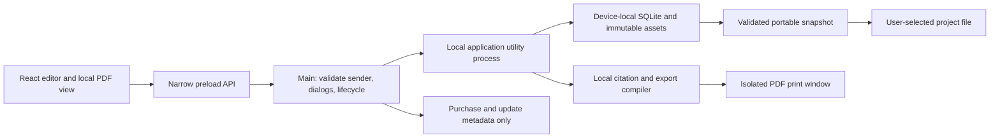

# Collie Writer MVP implementation plan

## 1. Product brief and scope

**Prepared September 29, 2026; Stage 1 implementation updated September 29, 2026. Status: Stage 1 partial — external checks pending; Stages 2–23 not started.** The historical documentation request refers to `mvp-planning-prompt.md`, which is absent from the current checkout; no replacement has been invented. The subsequent explicit Stage 1 request authorized its local implementation and necessary in-scope fixes. Purchases, account registration and publication remain separately authorized actions. See [Stage 1 evidence](docs/validation/stage-01.md).

The entire September 29 exploration in the reference workspace was reviewed. Its product decisions are incorporated here; its code paths, test results, provisional Forge recommendation and broad stage numbers do not describe this repository. Future sessions need only this repository. Do not copy its source, private research, conversations or data, and do not require the reference workspace to execute this plan.

### Confirmed requirements

The product name is **Collie Writer**. The seller country and initial sales market are **the United States**, with **USD** pricing. The actual legal seller identity is not yet selected; do not invent a company name or treat the product name as the verified legal seller. Merchant, tax/payout, signing and store accounts must later use the owner's actual verified identity. This is an external production-setup dependency, not an unanswered product question or a blocker to local implementation.

Use **`com.colliewriter.app`** as the selected production app/bundle identifier, **`com.colliewriter.app.dev`** for development and **`com.colliewriter.app.beta`** for isolated beta builds, with separate local data roots. Engineering will apply these during the owning stages. Before production registration, verify namespace/domain control, identifier availability and channel compatibility; the selected string does not establish ownership of `colliewriter.com` or reserve an account. Resolve any actual registration conflict before first production release and record the replacement; do not silently change a shipped identity. Apple documents the [bundle-ID syntax](https://developer.apple.com/help/glossary/bundle-id/), and [electron-builder v26](https://www.electron.build/v26/docs/mac/) maps an explicit app ID to the macOS bundle identity (checked September 29, 2026).

**No ads, anywhere, ever.** Collie Writer and its controlled app, tutorial, help, checkout and website surfaces must remain ad-free in every access mode, release channel and future edition. Do not add banner/interstitial/native ads, sponsored recommendations, affiliate promotions, rewarded ads, first-party promotional/upsell placements, advertising SDKs or ad tracking. Keep factual product/pricing information and user-initiated purchase/manage-access controls; never monetize free access or entitlement failure through advertising.

Build a fresh desktop product for research-heavy nonfiction authors and independent researchers. Templates for books, articles, research papers, reports and blank projects share one schema. The daily workflow is **capture → inspect sources → connect evidence and arguments → write/reorganize → cite → review/revise → export/back up**. The non-AI value is traceability: follow a quotation to its source, see supporting and challenging evidence for a section, reorganize without breaking citations, and hand a dependable document to an editor.

The first paid release must work offline for writing, local research, organization, citations, required exports and recovery. Opening a project requires neither an application account nor an AI account. Ship signed direct downloads for macOS and Windows; Linux/mobile are excluded. Store distribution has independent gates and may open later. AI approval cannot block the non-AI release.

Users own their projects and choose each save destination through a native dialog, including writable OneDrive folders. Every new project starts with no destination. A remembered directory only initializes the picker. The vendor never receives or hosts manuscript content, research libraries, attachments, project histories or backups. Purchase/update services may hold necessary non-content metadata. No diagnostic upload may contain project content. A customer-selected cloud service receives files through that customer's own storage arrangement.

The intended base offers are **$9.99/month** and **$199 lifetime access to the purchased edition**, initially `nonfiction`. Lifetime includes **all future updates to that edition**, including later approved desktop AI functionality; it is not limited to a major version. Paid access permits unlimited projects. Future fiction is a separately scoped edition. United States checkout uses USD base prices; applicable taxes and displayed totals come from the verified channel configuration.

There is no timed trial, evaluation countdown, automatic conversion, output watermark or damaged export. Entitlement changes never remove work or block reading, recovery, exports or backups. Later AI uses only approved supported SDK/runtime connections and eligible subscription sessions, checked before every operation. No API-key UI, metered fallback, purchased-credit consumption or top-up route is permitted. Successful login does not establish commercial eligibility or included-only funding. AI proposes inspectable, evidence-linked work; applying edits or structural changes is a separate reversible user action.

### Approved first-release capability matrix

Josh approved this capability matrix on September 29, 2026, with the permanent no-ads requirement. It is the implementation baseline; usability and commercial-value validation remain release work, not a request to reapprove the matrix. The entitlement system is not implemented yet.

| Capability                                                                              | Untimed free                                                                                         | Subscription / lifetime nonfiction                                                                    |
| --------------------------------------------------------------------------------------- | ---------------------------------------------------------------------------------------------------- | ----------------------------------------------------------------------------------------------------- |
| Personal projects                                                                       | One explicitly designated editable project at a time; freely switch designation after flushing edits | Unlimited editable projects; no paid project-count ceiling                                            |
| Synthetic tutorial project                                                              | Separate clearly labeled sample, resettable without touching personal work                           | Same                                                                                                  |
| Core editor, outline moves/splits, notes, sources, evidence, citations, search, history | Complete supported subset in the designated project                                                  | Same features across unrestricted workspaces                                                          |
| Existing projects                                                                       | Read, inspect, recover, restore to a copy, export and back up every project                          | Same                                                                                                  |
| Standard DOCX/PDF/Markdown/text and bibliography outputs                                | Full fidelity, no watermark; project/section selection and standard presets                          | Same                                                                                                  |
| Compilation convenience                                                                 | Standard presets; export any existing saved recipe, including after expiry                           | Create/edit reusable named recipes and generate several formats in one batch from one frozen revision |
| Updates                                                                                 | Supported free mode updates                                                                          | All edition updates while subscribed; all future edition updates for lifetime owners                  |

Every cell above is permanently ad-free, including free, expired, offline and recovery states.

The paid distinction is concurrent unrestricted work plus repeatable multi-output compilation; stored-project count alone is insufficient because free designation can rotate. Stage 18 tests comprehension and value with target writers **before Stage 20 builds checkout**. If users will not pay for these shipped non-AI capabilities, improve usability/positioning or defer sale; proposed changes to the approved capability matrix require a recorded product decision. Never add ads, restrict recovery, damage exports or sell future AI promises. No future desktop feature inside the owned edition may demand a second lifetime purchase.

### Supported editor and output subset

Under Josh's delegated judgment, adopt the following initial subset: English UI, Unicode content, APA 7 author-date and Chicago notes/bibliography, single-column Letter/A4 manuscripts, genuine footnotes, simple tables and inline images. These scope choices are settled for implementation; the existing technical/license/fidelity gates still apply.

| Area                  | MVP contract                                                                                                                                                                                               | Explicit limit / loss behavior                                                                                                                      |
| --------------------- | ---------------------------------------------------------------------------------------------------------------------------------------------------------------------------------------------------------- | --------------------------------------------------------------------------------------------------------------------------------------------------- |
| Writing               | Paragraphs; headings 1–3; bold/italic/underline/strike; ordered/bullet lists; block quotes; safe links; horizontal/page breaks; section title/status/synopsis; word counts; find/replace; local spellcheck | No arbitrary HTML/CSS, executable embeds, equations, text boxes, collaboration or Word tracked changes                                              |
| Images and tables     | Managed PNG/JPEG images, alt text, captions and bounded sizing; rectangular tables with header rows, plain cell content and sensible page splitting                                                        | No merged/nested tables, floating images or complex wrapping; unsupported imports produce a report                                                  |
| Notes and annotations | Editable independent notes, tags and reusable categories; inline comments/annotations with explicit resolved/orphaned state                                                                                | Comments remain project data; optional annotated export is separate from the clean manuscript                                                       |
| Footnotes             | Editable text with basic inline formatting and citations; sequential numbering in compilation; true DOCX footnotes and PDF page footnotes                                                                  | No nested notes, figures or tables inside footnotes. Pagination must pass Stage 3; endnotes cannot silently replace promised footnotes              |
| Citations             | Stable citation clusters with per-item locators/prefix/suffix; local bibliography; pinned APA 7 and Chicago notes/bibliography CSL styles/locales                                                          | No universal journal support; rendered Word citations are editable text and footnotes, not promised Zotero/Word citation-manager fields             |
| DOCX / PDF            | Single-column Letter/A4; named paragraph styles; page numbers; controlled margins/fonts/spacing; section/page breaks; supported tables/images/captions/footnotes/bibliography                              | No universal Word round-trip, final book typesetting or identical pagination between DOCX and PDF                                                   |
| Markdown / text       | UTF-8 import/export, heading/list/quote structure, readable resolved citations/bibliography; Markdown footnotes and relative managed image references with a sidecar export folder                         | Report unsupported rich structure, lost formatting and omitted image pixels in text. These exports are not project backups                          |
| Bibliography          | CSL JSON plus documented BibTeX/RIS subset: article, book, chapter, report, thesis, webpage; creators, dates, title/container, DOI/URL, pages, edition, publisher and identifiers                          | Preserve raw input/unknown fields separately; report unmapped fields and invalid records; no claim that cross-format conversion retains every field |
| Imports               | Plain text/Markdown into drafts; local PDF/text as source material; supported bibliography files                                                                                                           | Arbitrary DOCX ingestion, conversation imports, OCR, web clipping and Zotero live sync are deferred; do not imply DOCX export includes DOCX import  |

Use English UI and bundled offline locale/font assets. Test Latin accents, combining marks, CJK, mixed-direction quotations and keyboard IME. Declare script/layout coverage from actual export/editor results; adding full RTL manuscript layout or localization is separate scope. Stage 3 resolves font fallback and page layout before production editor schema freeze.

Purchase portability is also selected under delegated judgment: one direct purchase covers the same customer's Mac and Windows installations. Each store channel initially promises only its own proven restore behavior. Cross-store unlocks remain a later engineering/policy evaluation; do not advertise universal restore until it is implemented and verified.

Excluded from the numbered MVP: AI generation or login, provider runtimes, semantic embeddings, web crawling, cloud content services, application sync, mobile, remote workers, real-time collaboration, CRDTs, graph UI, plugin marketplaces, fiction, password-encrypted project files, EPUB/LaTeX and arbitrary journal/Word compatibility. OS disk/account protection is recommended; do not market the unencrypted portable archive as encrypted against a cloud provider.

## 2. Starting-state audit

**Historical baseline:** the audit below describes the pre-implementation scaffold. Stage 1 now has a validated local checkpoint; see the [current evidence](docs/validation/stage-01.md) and [D1 decision](docs/decisions/D1-runtime-and-shell.md). Current commands include Vitest, Electron integration and desktop suites; macOS packaging now runs typecheck. The original prompt is absent in the current tracked tree, despite the planning-time observation below.

Audit date: September 29, 2026; initial commit `c109430`, branch `main`. The planning prompt was already untracked. No root/nested or applicable ancestor `AGENTS.md` existed. `desktop-app-exploration.md` is not in this repository; its absence here is expected. The only useful current application behavior is the generated Electron welcome screen and sample ping.

### Actual dependencies and configuration

`package-lock.json` is lockfile version 3. Installed direct packages match the lockfile; manifest ranges are not resolved versions.

| Package                 | Manifest             | Locked / installed |
| ----------------------- | -------------------- | ------------------ |
| Electron                | `^39.2.6`            | `39.8.10`          |
| electron-vite           | `^5.0.0`             | `5.0.0`            |
| electron-builder        | `^26.0.12`           | `26.15.3`          |
| Vite                    | `^7.2.6`             | `7.3.6`            |
| React / React DOM       | `^19.2.1`            | `19.3.0`           |
| TypeScript              | `^5.9.3`             | `5.9.3`            |
| React Vite plugin       | `^5.1.1`             | `5.2.0`            |
| ESLint / Prettier       | `^9.39.1` / `^3.7.4` | `9.39.5` / `3.9.9` |
| Toolkit preload / utils | `^3.0.2` / `^4.0.0`  | `3.0.2` / `4.0.0`  |
| Node types              | `^22.19.1`           | `22.20.4`          |

Host observed: macOS 27.0 arm64, Node `22.22.3`, npm `10.9.8`. No `engines`, package manager field or Node version pin exists. Installed build-tool engines require Node `^20.19.0 || >=22.12.0`, which this host satisfies. Host Node and Electron's embedded Node/native-module runtime are separate compatibility checks.

| Existing files                                                       | Foundation and gaps                                                                                                                                                                                                                    |
| -------------------------------------------------------------------- | -------------------------------------------------------------------------------------------------------------------------------------------------------------------------------------------------------------------------------------- |
| `src/main/index.ts`                                                  | One window, macOS activation and quit handling, dev URL / production `loadFile`, sample IPC. Explicit `sandbox: false`; Node integration/context isolation rely on defaults. No dialogs, storage, lifecycle flush or sender validation |
| `src/preload/index.ts`, `src/preload/index.d.ts`                     | Context bridge exists, but exposes broad toolkit API and an empty `api`. Installed toolkit exposes arbitrary IPC, raw events and `process.env`; fallback attaches globals if isolation is off                                          |
| `src/renderer/index.html`                                            | CSP exists (`self` scripts; inline styles; self/data images), title is Electron. Requires deliberate production protocol/network policy, not a claim that there is no CSP                                                              |
| `src/renderer/src/{main.tsx,App.tsx}`, `components/Versions.tsx`     | React StrictMode, template screen, ping and version display only                                                                                                                                                                       |
| `src/renderer/src/assets/`                                           | Template logos/backgrounds; CSS hides overflow and disables text selection globally                                                                                                                                                    |
| `electron.vite.config.ts`                                            | Single-package main/preload/renderer build and React plugin; renderer alias. No worker entries/shared-contract configuration                                                                                                           |
| `tsconfig*.json`, `eslint.config.mjs`                                | Separate Node/web projects, lint setup. Inherited strict config explicitly permits implicit `any`; proposed shared/worker/tests need include coverage                                                                                  |
| `electron-builder.yml`                                               | Builder pipeline, NSIS/DMG defaults; exclusion list rather than positive resource allowlist; placeholder identity/feed; Linux targets; `npmRebuild: false`; `notarize: false`                                                          |
| `build/entitlements.mac.plist`, `build/icon.*`, `resources/icon.png` | Template artwork and broad JIT/unsigned-memory/DYLD entitlements; unrelated camera/microphone permissions in builder config require review/removal                                                                                     |
| `README.md`, dotfiles, `.vscode/`                                    | Scaffold setup/debugging conventions; README still advertises Linux                                                                                                                                                                    |

External links are passed directly to `shell.openExternal` with no scheme validation. There are no navigation/permission guards or runtime-validated application commands. No database/editor/export/citation dependencies, tests, CI, app updater or user data model exist. There is no Express server to retain, and the old application's passing tests say nothing about this scaffold.

### Existing commands and observed checks

| Command                     | What exists today                                                                                               |
| --------------------------- | --------------------------------------------------------------------------------------------------------------- |
| `npm ci`                    | Reproducible lockfile install; invokes existing postinstall; not run during planning                            |
| `npm run dev` / `npm start` | electron-vite dev / preview; no desktop session started during planning                                         |
| `npm run typecheck`         | Runs `typecheck:node` and `typecheck:web`, both no-emit; **passed during planning**                             |
| `npm run lint`              | `eslint --cache .`; equivalent non-caching `./node_modules/.bin/eslint . --no-cache` **passed during planning** |
| `npm run build`             | Typecheck then electron-vite build; not run during planning                                                     |
| `npm run build:unpack`      | Build then builder `--dir`; not run                                                                             |
| `npm run build:win`         | Build then builder `--win`; not run                                                                             |
| `npm run build:mac`         | electron-vite build then builder `--mac`; currently skips typecheck; not run                                    |
| `npm run build:linux`       | Generated Linux target; remove in Stage 1                                                                       |
| `npm run format`            | `prettier --write .`; avoid for narrow work because it rewrites unrelated files                                 |
| `npm run postinstall`       | `electron-builder install-app-deps`; not proof that a future SQLite dependency loads in a package               |

There is no test script today. No native SQLite, export, signed package, Windows, Intel Mac, store, recovery or commerce check has passed. Documentation checks at the end of this file are separate from application stage completion.

## 3. Target architecture and shared contracts

### Module and process boundaries

Retain one npm package and the actual electron-vite/electron-builder pipeline. Do not scaffold again, migrate to Forge to match the old report, introduce a monorepo framework or ship a loopback HTTP API. The following paths are **proposed unless listed in the audit above**; introduce them only in their owning stage.

| Proposed path                                                                                          | Responsibility                                                                                                                 |
| ------------------------------------------------------------------------------------------------------ | ------------------------------------------------------------------------------------------------------------------------------ |
| `src/shared/{commands,errors,schemas}.ts`                                                              | Runtime-validated IPC input/output/event schemas, serializable types and stable error codes; no Electron/filesystem imports    |
| `src/domain/`                                                                                          | IDs, editor schema, revision and evidence rules, compilation model and entitlement capabilities                                |
| `src/main/{ipc,protocol,windows,dialogs,lifecycle}.ts`                                                 | Trusted sender checks, native path grants, windows, menus, permissions and shutdown                                            |
| `src/main/{paths,preferences,entitlements,updates}/`                                                   | Device-local paths/destination mappings, secrets/receipts, purchase/update channel adapters                                    |
| `src/worker/index.ts`, `src/worker/{storage,projects,jobs,imports,research,search,citations,exports}/` | App-owned utility process; one serialized writer per project; local SQL, archive/file work and CPU-heavy processing            |
| `src/renderer/src/features/{projects,draft,outline,notes,sources,research,search,activity,settings}/`  | UI through the narrow preload API; editor runs here; no SQL, Node, receipts or arbitrary paths                                 |
| `tests/{unit,integration,desktop,fixtures}/`, `scripts/`                                               | Synthetic fixture factories, destructive fault tests, packaged checks and local reports                                        |
| `docs/{decisions,validation}/`                                                                         | Short decisions and per-stage evidence, created when work needs them; this plan remains the authoritative stage/progress index |
| `resources/{styles,locales,fonts}/`                                                                    | Reviewed offline CSL/font resources with licenses and precise build allowlisting                                               |



Main issues scoped, window-bound, purpose-bound opaque location tokens from native selections. Workers receive resolved grants only from main; renderer never supplies unrestricted OS paths or arbitrary SQL. An asset protocol resolves authorized project/blob IDs to safe bytes, with MIME checks, path containment and no active scripts. The production app protocol serves only bundled assets; guard traversal/symlinks and validate top-level sender origin/frame. Deny navigation, popups and permissions by default; HTTP(S) external navigation requires a deliberate user gesture and validated URL. Custom purchase callbacks have a separate narrowly verified route. No network resource loading from imported HTML/PDF or print windows.

Use a utility process for the database and jobs, with a small separate parser process where untrusted parsing needs resource limits. Electron's utility process is fault isolation, **not an automatic security sandbox**. Restrict code paths, tokens, input sizes and libraries; never execute imported code. Main can create a hidden sandboxed print window on the worker's request using validated compilation data. All processes have owned shutdown, progress, cancellation and crash reconciliation; no general task broker or distributed queue.

### Core identities, relationships and revisions

Use UUIDs for application identities and UTC ISO timestamps. Filenames, DOI, URLs and human-readable titles are attributes, not primary keys. SHA-256 identifies immutable blob bytes; never send these content hashes to vendor services. Foreign keys include project ownership, and every read/write checks the active project. No cross-project joins by accidental UUID alone.

| Entity                            | Contract / cardinality                                                                                                                                                                                                                                                                                                                |
| --------------------------------- | ------------------------------------------------------------------------------------------------------------------------------------------------------------------------------------------------------------------------------------------------------------------------------------------------------------------------------------- |
| Project                           | `id`, template, title, locale, format/schema versions, `headCommitId`. One project owns all manuscript/research entities; its chosen destination lives in device settings, not the portable DB                                                                                                                                        |
| Document                          | `id`, nullable parent document ID, ordered sibling position, kind/title/status/synopsis, `revisionId`, versioned `DocumentPayload = { ast, footnotesById }`. Tree cannot contain cycles; folders and text sections are distinct kinds                                                                                                 |
| Block / anchor                    | Unique `blockId` per project on addressable editor blocks. Moves preserve IDs; copy/paste creates IDs; text ranges use block ID, revision, offsets and quoted context. Anchors are mapped through edits or marked orphaned, never reassigned by an ambiguous text match                                                               |
| Operation / commit                | `operationId`, request digest, project ID, parent commit ID, new commit ID, changed entity revisions and result. One durable transaction per command; duplicate ID with same payload returns prior result, different payload fails                                                                                                    |
| History checkpoint                | Immutable document/structural snapshot, parent checkpoint, actor (`human` initially), reason, timestamp and referenced blobs. Not every keystroke must be retained as a full history snapshot; acknowledged current content is always durable                                                                                         |
| Note / annotation                 | Independent editable note revision, tags/categories, optional section/source links and human origin; annotations target stable anchors, track resolution/orphan status                                                                                                                                                                |
| Source / source version           | One canonical work per project; CSL metadata, original imported records and field provenance. Immutable source versions preserve exact original/extracted content and extraction version. Sources have many attachments/excerpts and many uses                                                                                        |
| Blob / managed asset / attachment | Blob bytes deduplicated by hash; project-owned managed asset has ID, original filename, media type, size, purpose and hash. Source attachment joins source ID to asset ID; document/note image nodes reference asset IDs independently, so images work before the source library exists. Required originals/images are managed copies |
| Excerpt                           | Exact original or extracted text, source-version ID, optional attachment/page/range, extraction method and context; manual transcription is explicitly labeled. A note/paraphrase is not an exact quotation                                                                                                                           |
| Claim / research question         | Human statement or question with its own revision and optional section anchors; many claims/questions per section, many evidence records per claim                                                                                                                                                                                    |
| Evidence link                     | Source or excerpt → claim or section, role `support`, `challenge`, `background` or `potential_use`, origin/review status. Many-to-many; links do not duplicate source records                                                                                                                                                         |
| Research decision                 | Unique question/source pair with candidate/kept/rejected state, reason and revision. Rejection is reversible and question-specific, not a global source blacklist                                                                                                                                                                     |
| Citation / footnote               | Citation ID is an inline atom referencing one or more source items and locators. Footnote reference atom points to a footnote body. Actual citation usage is derived from authoritative document content in the same commit; cannot be invented by an evidence link                                                                   |
| Job                               | Device-local job ID, operation ID, project/revision inputs, queued/running/cancelling/completed/failed/interrupted state and result. Stage-owned parsers/indexers/exporters; no AI or remote worker yet                                                                                                                               |

Document `revisionId` and project `headCommitId` change on accepted mutations. Revision IDs are opaque UUIDs, not timestamps. Local counters may aid display but cannot compare branches from different computers. A restore creates a new commit/checkpoint, preserving the later version. History defaults: explicit and pre-structural checkpoints retained; coalesced automatic checkpoints at least every 30 seconds of active editing, with a proposed 30-day retention policy and size preview. Retention never deletes unsaved recovery or blobs still referenced by current content, retained history, excerpts or active jobs. Stage 9 validates history cost and finalizes the policy.

Keep portable domain commits/checkpoints separate from device-local jobs, grants, save intents, output paths, receipts and operation-delivery records. Use a separate device-local operations/settings store for the latter; do not embed them in `project.sqlite`. Portable mutation results contain IDs/revisions only. Reconcile cross-store jobs through idempotent domain operation IDs; do not pretend two SQLite files share an atomic transaction. Snapshot validation rejects local-only fields and known synthetic path/secret canaries.

Editor content is a versioned JSON AST with an explicit node/mark allowlist; no raw HTML as canonical content. Store citation/footnote IDs and source references in canonical nodes; SQL occurrence tables are transactional derived projections. On copy/paste remap all block/citation/footnote IDs; on moves keep them. Split initially operates **between top-level blocks**; moving half a paragraph is deferred. Multi-document operations validate every input revision and update references atomically. Deletion tombstones referenced items and offers restore; a missing anchor/source produces a visible issue, never a silent reassignment.

`DocumentPayload` owns both main AST and footnote bodies under one document revision; `document.commit` validates/persists them atomically. Each footnote reference has exactly one owned body. Copy duplicates/remaps reference and body; cross-document move/split transfers both in the structural transaction; history retains removed bodies. An author note may contain citation atoms, but never nested footnotes. APA/Chicago switching formats a citation already inside an author note within that note. Chicago prose citations generate compilation notes; automatic citation notes and author notes share final numbering and CSL `noteIndex`, without creating a note inside a note.

### Command envelope and failure semantics

Proposed contract shape (not executable code in this task):

```ts
type CommandMeta = { requestId: string; operationId?: string }
type Result<T> =
  | { ok: true; requestId: string; value: T }
  | {
      ok: false
      requestId: string
      error: {
        code: string
        message: string
        retryable: boolean
        details?: unknown
      }
    }
type MutationResult = { headCommitId: string; entityRevisions: Record<string, string> }
```

`details` is validated per error type, not arbitrary serialized exceptions. Errors include `VALIDATION`, `DENIED`, `STALE_REVISION`, `PROJECT_LOCKED`, `DESTINATION_UNAVAILABLE`, `EXTERNAL_CHANGE`, `DISK_FULL`, `FORMAT_TOO_NEW`, `CORRUPT_PROJECT`, `MIGRATION_FAILED`, `CANCELLED` and `JOB_INTERRUPTED`. User-facing local messages may identify the selected location; diagnostic records exclude titles, paths, content and secrets. Invalid commands return an actionable error without partial writes. A lost response is reconciled by operation ID before retry; do not automatically repeat unknown-outcome operations.

| Command                              | Input → output; invariant                                                                                                                                                   |
| ------------------------------------ | --------------------------------------------------------------------------------------------------------------------------------------------------------------------------- |
| `project.create`                     | Template ID → project/workspace IDs, initial head, `destination: null`; locally protected immediately                                                                       |
| `project.open`                       | Purpose-bound open token → validated workspace and saved lineage; no edit of archive DB in place                                                                            |
| `document.commit`                    | Project/document IDs, expected document revision, schema version, DocumentPayload, operation ID → new document revision and project head; durable local acknowledgment only |
| `outline.change`                     | Project, expected revisions for all affected documents/tree, move/split/merge change → atomic new revisions and anchor mappings                                             |
| `project.save`                       | Project, minimum acknowledged head, expected destination generation → job/result containing actual snapshot/head saved; first save obtains native choice in main            |
| `project.saveAs`                     | Project, minimum head, save token → new destination after verification; same project identity, old file retained                                                            |
| `project.duplicate`                  | Project → new project identity/workspace, preserved internal references scoped to new project, destination null                                                             |
| `project.backup` / `project.restore` | Project/expected current head and backup token → captured-head portable snapshot; restore token → inspectable new workspace, no overwrite of active work                    |
| `source.import` / `source.reimport`  | Project, picker token, source/version expectations → staged report then atomic commit; annotate import provenance and preserve old versions                                 |
| `evidence.link` / `citation.insert`  | Valid owned IDs, expected revisions, role or citation items → updated revisions; these commands have different semantics                                                    |
| `project.export`                     | Project, expected current head/compile options, export token → captured-head job, device-local output paths/status/loss report; no mutation of manuscript or saved status   |
| `entitlement.selectFreeProject`      | Local project ID, expected policy revision → persisted designation after pending edits flush; no project identifiers sent to commerce                                       |

Expose individual preload methods and typed subscriptions with unsubscribe functions. Validate both requests and worker responses. Progress events carry IDs, totals/status and bounded display data, not raw Electron event objects. Reject invalid sender frame, stale token, cross-project ID and oversized payload before filesystem work. Source input may be large, so stream files in trusted code rather than pushing file bytes through IPC. Set explicit per-command limits in owning stages and test valid substantial manuscripts, not arbitrary tiny prototype limits.

Export/backup first atomically compare the expected current head and freeze a coherent local snapshot while briefly holding the mutation/capture boundary; a stale head returns `STALE_REVISION` for explicit refresh. Return its actual `capturedHead` and job ID, then allow later edits during compilation/transfer. Only retained full checkpoints can supply historical exports. An arbitrary old commit ID is not necessarily materializable; never label current records with an unavailable historical head. Destination Save uses the separately defined minimum-head rule.

### Working storage, saved snapshots and recovery

Default working roots: verified device-local Application Support on macOS (sandbox container for MAS), and OS Known Folder `LocalAppData` on Windows, **not blindly Electron's roaming `userData` path**. Keep preferences separate where appropriate. Detect/test redirected or mirrored roots; if a safe local root cannot be established, explain and require a verified device-local working location. Never put live WAL beside the chosen archive. Customer-chosen destinations remain available regardless of this working-root rule. [Windows Known Folders](https://learn.microsoft.com/en-us/windows/win32/shell/knownfolderid) distinguishes local and roaming application data.

```text
device-local app data/
  settings/                        recent locations, grants, free designation
  workspaces/<project-id>/<workspace-id>/
    working.sqlite                 portable domain data + domain commit records
    working.sqlite-wal / -shm      managed by SQLite while needed
    blobs/<sha256>                 immutable originals/images/history assets
    recovery.json                  repairable workspace discovery
    operations.sqlite              local jobs/save intents/results; never portable
  retained-snapshots/               local recovery aids, disclosed size/retention

user-selected Research.collie      proposed ZIP64 archive
  manifest.json                    versions, project/snapshot/head IDs, parent snapshot
  project.sqlite                   closed consistent snapshot, no WAL dependency
  blobs/<sha256>                   every asset needed by current data/retained history
  citation-assets/<sha256>          selected pinned CSL styles/locales and notices
```

Use a streaming ZIP64 container with precompressed PDF/images stored without recompression; candidate `yazl`/`yauzl` are evaluated and pinned in Stage 5. No custom compression format. The manifest contains format/schema/editor versions, minimum compatible reader, snapshot ID, parent snapshot ID, head commit ID, database hash, blob/citation-asset hashes/sizes and creation time. It contains no absolute paths, machine identity or license secrets. Hashes detect corruption, not authenticity. Selected CSL style/locale bytes, identifiers, hashes and attribution/license notices travel with the project so clean-machine restore does not require an obsolete download. Validate these XML assets with external entities/network disabled and supported-schema/resource limits. Search caches are rebuildable; exact excerpts and original source versions are not disposable caches.

Working lineage is `{headCommitId, baseSnapshotId, baseSnapshotHead}`. Destination mapping records the last verified snapshot ID and content fingerprint plus native grant. Snapshots form a parent chain; different branches cannot be resolved by comparing timestamps or integer revisions. Save As retains project identity and switches destination only after success. Duplicate creates a new identity. A restored backup defaults to a new project identity with recorded origin; replacing an existing project's working state requires a separate inspected restore and checkpoint.

**Local commit:** validate → durably stage/hash/validate/promote any new immutable blob bytes and supported directory metadata → SQLite transaction updates content/revisions/projections/domain operation result → commit with `foreign_keys=ON`, WAL and initial `synchronous=FULL` → acknowledge. Failed SQL may leave collectible orphan bytes; successful SQL must never reference uncommitted/missing blobs. Use one application-owned writer and serialize mutations. A failed write leaves the editor buffer visible with retry/copy/export emergency options and does not claim recovery. Test actual disk-full and worker-crash behavior. WAL is same-host storage, and SQLite's current WAL documentation records a fixed corruption issue: require SQLite **3.51.3 or later (or a verified fixed backport)** and log `sqlite_version()` in package evidence. [SQLite WAL](https://sqlite.org/wal.html).

**Destination save:** flush pending UI edits first; start a coalesced job; acquire a capture/garbage-collection barrier or provisional blob pin epoch; obtain a coherent SQLite backup; read the head and blob references **from the copied database**, not a stale pre-backup guess; narrow to durable leases for those blobs before releasing the capture barrier; build/validate the archive; check destination generation; write a sibling staging file on that destination volume; flush/close/verify it; immediately recheck target existence/identity/fingerprint and bind overwrite consent to that generation; preserve the previous valid snapshot; replace with a tested platform mechanism including supported directory/metadata durability; reopen/verify; then persist the save acknowledgment. Only copied head `K` is marked saved; edits after `K` remain pending. Explicit Save must contain the requested acknowledged head or a descendant, not an earlier revision. SQLite backup is a consistent copy mechanism; copying an active main DB file without its journal is not. [SQLite backup API](https://www.sqlite.org/backup.html).

Record save intent before replacement and reconcile if the app crashes after file replacement but before local acknowledgment. Handle a missing final file and surviving staging/previous files without guessing that the write failed or succeeded. Preserve candidates until inspected. A local lock plus fingerprint comparison reduces conflicts but cannot make remote/cloud replacement a cross-machine compare-and-swap. Detect changes before save, after replacement and on reopen; preserve both versions and offer inspect/open copy/save copy. Do not auto-merge or silently overwrite an observed external change. Network/removable destinations may lack atomic replacement; Stage 6 probes actual behavior and refuses unsafe completion while retaining recovery and offering Save As.

Native first Save cancellation leaves destination null. Background recovery commits occur after a proposed 750 ms debounce and no later than 5 seconds during continuous editing; destination autosave is coalesced, initially after 30 seconds of idle and at most one active save, with an explicit Save/close flush. Stage 5/8 measurements may adjust cadence without relabeling guarantees. Confirmed local commits survive process crash; unacknowledged keystrokes cannot be promised after sudden power loss. Closing with a failed destination save offers Retry, Save As or an explicit close-with-local-recovery choice after local commit; never claim the chosen file is current.

| Visible state                                                  | Exact meaning                                                             |
| -------------------------------------------------------------- | ------------------------------------------------------------------------- |
| Protecting edits locally                                       | Buffer not yet durably acknowledged; do not show Saved                    |
| Unsaved project — recovery on this computer                    | Local commit succeeded; no destination assigned                           |
| Newer edits protected locally                                  | Working head is ahead of the last destination snapshot                    |
| Saving to chosen location                                      | Snapshot job pending/running; typing can continue                         |
| Saved to chosen location at revision K                         | Verified destination commit contains K; **no claim about cloud upload**   |
| Destination unavailable / external change / local write failed | Distinct errors, revision information and recovery actions; preserve work |

Archive open rejects absolute/traversal paths, symlinks, duplicate/case-colliding entries, unexpected executable entries, invalid hashes and unsupported schema. Validate resource limits and free space before extraction; initial engineering budgets are 100,000 entries / 100 GiB expanded archive and 1 GiB individual source file, with explicit reports rather than crashes. Do not trust declared sizes or compression ratios; enforce streaming limits. Stage 5 may revise budgets against fixtures. Extract into isolated staging, validate database schema with trusted schema disabled/no loadable extensions, then promote a local workspace. A malformed database must not supply SQL migrations or executable code.

All persistent-format changes are forward migrations on a **copy**, with verified pre-migration backup, transaction checks and explicit minimum reader version. Never mutate the only saved file on open. Migration failure retains both original and recovery; newer formats refuse writes with guidance to use a compatible app. Code rollback cannot safely downgrade an already migrated file: restore the preserved older copy or use a forward fix. Data schema, AST schema and archive version are tracked separately. New consumers, serializers, projections, fixtures and docs must migrate together.

### Selected defaults and bounded technical decisions

Engineering owns these spikes; they are not unanswered product questions. Each ends with an ADR under `docs/decisions/`, exact versions, fixtures, results and a decision. A failed spike blocks its consumers, not unrelated work. Day limits are investigation budgets, not delivery promises; never declare a failed requirement solved when the budget expires.

| ID / owner stage  | Selected default and timebox                                                                                        | Required result / decision deadline                                                                                                                                                                                                                                                                                                                                                                                 |
| ----------------- | ------------------------------------------------------------------------------------------------------------------- | ------------------------------------------------------------------------------------------------------------------------------------------------------------------------------------------------------------------------------------------------------------------------------------------------------------------------------------------------------------------------------------------------------------------- |
| D1 / Stage 1      | Keep electron-vite 5 and builder 26; adopt a then-supported pinned Electron and Node LTS; 1 day compatibility proof | Accepted local checkpoint: Electron 44.5.0, host Node 24.21.0/npm 11.19.0; sandboxed preload and protocol pass in unsigned macOS arm64 package. [D1](docs/decisions/D1-runtime-and-shell.md); native Intel/Windows checks pending; no unrelated blanket upgrade                                                                                                                                                     |
| D2 / Stage 2      | `better-sqlite3` 13.0.3 candidate in utility process; 2 days native/package proof                                   | Its current Node-API prebuilds and bundled SQLite 3.53.4 are candidates, not installed proof. Verify N-API/native load, FTS5, backup and crash recovery per target; explicit build fallback if prebuild fails                                                                                                                                                                                                       |
| D3 / Stage 3      | Tiptap community 3.x/ProseMirror, app-owned citation/footnote nodes; `docx`; local CSL processor; 3 days            | Freeze tested JSON/compile subset and exact pins before Stage 8. No paid/cloud editor service required                                                                                                                                                                                                                                                                                                              |
| D4 / Stage 3      | `citeproc-js` candidate under reviewed CPAL option; 1 day license/artifact assessment in parallel                   | Actual distributed license/attribution/source obligations must fit the product. Metadata is inconsistent; do not call it MIT or hide it through Citation.js. If incompatible, select a maintained compatible local processor and rerun both style fixtures before Stage 15                                                                                                                                          |
| D5 / Stage 3      | Paged.js in isolated Chromium print window, then `printToPDF`; 3 days with D3                                       | True page footnotes, tables, images and font shaping must pass. Paged.js footnote defects are a known risk. Permit a bounded 2-day targeted fix/evaluation of an alternate local paged renderer; Stage 3 cannot complete without a selected engine passing local required fixtures. Only external target-machine checks may remain partial. Do not silently drop footnotes or defer architecture choice to Stage 17 |
| D6 / Stage 5      | Streaming ZIP64 snapshot and immutable managed blobs; 2 days benchmark                                              | Prove 5 GiB/10 GiB library saves, workspace/snapshot lineage and disk amplification. If budgets fail, assess container implementation improvements before format v1 freeze, retaining one portable self-contained snapshot                                                                                                                                                                                          |
| D7 / Stages 18–20 | Capability service then Paddle direct commerce + minimal entitlement metadata service; 2 days technical feasibility | Confirm recurring/one-time USD offers for the United States, webhook verification/restore/offline signed grants and privacy/no-ads requirements. Paddle is the selected engineering default, subject to actual seller eligibility and D7 results; obtain verified legal seller/account details before live configuration                                                                                            |
| D8 / Stage 22     | MAS-specific adapter; Microsoft Store EXE listing first, MSIX only if its benefits justify it; 2 days per channel   | Revalidate current store policy, sandbox/file grants and actual purchase/update route. Pending store work does not block direct release                                                                                                                                                                                                                                                                             |

Primary-documentation checks were made on **September 29, 2026**. Exact packages must be revalidated when installed; a current web page or npm artifact is not proof of compatibility in a signed application. Source register in Section 7 records URLs and implications.

## 4. Numbered implementation stages

Implement only the requested stage. IDs below are permanent and supersede the exploration's broad numbering. Add future stages with new IDs rather than renumbering completed work. Stage 1 has a tested local checkpoint with native external checks pending; Stages 2–23 remain **not started**. Planning and baseline type/lint checks alone never establish stage completion.

| ID  | Outcome                                            | Dependencies                                   | Current status                                                   | External prerequisites / release gates                                     |
| --- | -------------------------------------------------- | ---------------------------------------------- | ---------------------------------------------------------------- | -------------------------------------------------------------------------- |
| 1   | Hardened scaffold and test foundation              | Existing scaffold                              | [Partial — external checks pending](docs/validation/stage-01.md) | Native Intel Mac/Windows execution pending                                 |
| 2   | Packaged native SQLite proof                       | 1                                              | Not started                                                      | None; target hardware is an external validation dependency                 |
| 3   | Editor/citation/export feasibility and licenses    | 1; package target from 2 for final native runs | Not started                                                      | None                                                                       |
| 4   | Durable working projects and versioned commands    | 1, 2                                           | Not started                                                      | None                                                                       |
| 5   | Portable snapshot codec and performance proof      | 4                                              | Not started                                                      | None                                                                       |
| 6   | Native first Save/Open and external conflicts      | 5                                              | Not started                                                      | None                                                                       |
| 7   | Recovery, backup and project lifecycle             | 6                                              | Not started                                                      | None                                                                       |
| 8   | Offline editor, templates and anchors              | 3, 4, 6                                        | Not started                                                      | None                                                                       |
| 9   | Outline operations and revision history            | 7, 8                                           | Not started                                                      | None                                                                       |
| 10  | Notes, inbox and annotations                       | 8, 9                                           | Not started                                                      | None                                                                       |
| 11  | Source library and bibliographic interchange       | 7, 10                                          | Not started                                                      | None                                                                       |
| 12  | PDF inspection, excerpts and safe reimport         | 11                                             | Not started                                                      | None                                                                       |
| 13  | Claims, questions and many-to-many evidence        | 9, 10, 12                                      | Not started                                                      | None                                                                       |
| 14  | Local search and indexing activity                 | 12, 13                                         | Not started                                                      | None                                                                       |
| 15  | Citations, footnotes and bibliography              | 3, 8, 11, 13                                   | Not started                                                      | None                                                                       |
| 16  | Compilation and dependable DOCX                    | 9, 15                                          | Not started                                                      | None                                                                       |
| 17  | PDF/text outputs and compilation conveniences      | 3, 14, 16                                      | Not started                                                      | None                                                                       |
| 18  | Untimed capabilities and entitlement transitions   | 7, 17                                          | Not started                                                      | None; approved capability matrix and permanent no-ads rule apply           |
| 19  | Onboarding, accessibility and privacy controls     | 14, 17, 18                                     | Not started                                                      | None                                                                       |
| 20  | Direct checkout, activation and restore            | 18 and its commercial-value gate               | Not started; local work possible before live configuration       | Verified legal seller/account details and live merchant setup              |
| 21  | Signed direct installers and secure updates        | 2, 7, 19; 20 local adapter contract            | Not started; release needs full 20                               | Verified signing identity, identifier/namespace checks and certificates    |
| 22  | Separate store-channel readiness                   | 18, 19, 21 local release architecture          | Not started; independent of direct launch                        | Verified seller/store accounts and channel-specific purchase/restore proof |
| 23  | Beta, release evidence and direct launch readiness | 1–21; excludes 22                              | Not started                                                      | Verified production identity, live commerce and signed direct artifacts    |

Recommended order is numerical, with Stage 3 research parallel to storage work, Stage 14 parallel to citation work once its inputs exist, and store work off the direct-release critical path. A downstream stage may use an explicitly documented **local checkpoint** from a prerequisite whose only missing checks are external, provided it does not depend on the unverified behavior. Keep that prerequisite partial; never count a mocked/native-missing check as complete. Stage 23 requires the actual target-platform results.

### Validation and completion conventions

Every stage below has ten required fields. **Baseline B** means `npm run typecheck`, `npm run lint`, `npm run build`, plus the relevant newly introduced tests. Existing package commands are listed above; all test commands here are **proposed** and must be introduced by their stated owner before use. No command's presence proves its check passed.

| Proposed command                              | Introduced by                     | Responsibility                                                                                                   |
| --------------------------------------------- | --------------------------------- | ---------------------------------------------------------------------------------------------------------------- |
| `npm test`                                    | Stage 1                           | Vitest domain/renderer suite; never discover real user data                                                      |
| `npm run test:integration`                    | Stage 1 harness; populated from 2 | Electron-runtime native/storage and file-fault tests in temporary roots, not host-Node bindings by accident      |
| `npm run test:desktop`                        | Stage 1                           | Playwright Electron workflow tests; test-only paths supplied before Electron starts                              |
| `npm run test:package -- --artifact <path>`   | Stage 2                           | Launch specified unpacked/installed artifact with isolated roots; verify resources, native runtime and lifecycle |
| `npm run test:storage`                        | Stage 4                           | Focused transaction/migration/recovery and snapshot suites, expanded in 5–7                                      |
| `npm run test:exports`                        | Stage 3                           | Golden semantic/structural export fixtures, expanded in 15–17; visual/Word checks remain separately recorded     |
| `npm run bench -- --suite <name>`             | Stage 5                           | Explicit synthetic storage/editor/search/export performance suites and machine metadata                          |
| `npm run test:entitlements`                   | Stage 18                          | Free/paid/offline/refund/expiry transitions using isolated fixtures; not live purchase verification              |
| `npm run audit:artifact -- --artifact <path>` | Stage 2                           | File allowlist, secret/test-content exclusions and native dependency inventory; Stage 21 adds signature checks   |

Suggested evidence files are `docs/validation/stage-NN.md`; they are proposed, not existing. Each stage's **Completion record** must capture status, changed paths/commit if available, exact commands and results, OS/architecture and artifact, manual checks done/pending, decisions, limitations and updated contracts/docs. Use `not started`, `in progress`, `partial — external checks pending`, `blocked — <specific reason>` or `complete`. Record failures honestly and continue independent authorized tasks. No stage is complete merely because compilation passes.

### Stage 1 — Harden the existing shell and establish checks

**1. Outcome and demonstration:** A developer launches a minimal Collie shell with native menus and a verified narrow bridge; malicious renderer requests cannot access files or environment variables.

**2. Prerequisites:** Existing scaffold and this plan; no product answer or commercial credential required. Read actual Git state before changing files.

**3. Scope boundaries:** Shell/security/tooling only. No project persistence, editor, checkout, AI or re-scaffolding. A dialog probe is developer-only and writes no project.

**4. Files/modules:** Change existing `src/main/index.ts`, `src/preload/index.ts`, `src/preload/index.d.ts`, `src/renderer/index.html`, `src/renderer/src/App.tsx`, assets, TS configs, `electron.vite.config.ts`, `electron-builder.yml`, `package.json`, lockfile and README. Add `src/shared/`, main IPC/protocol/window modules, test harness/config and native platform CI. Remove irrelevant template components/assets/Linux targets after checking imports.

**5. Detailed tasks:**

1. Record D1; pin supported Electron/host Node and verify builder/vite compatibility. Keep the existing build pipeline; make macOS packaging run typecheck like Windows.
2. Explicitly enable sandbox/context isolation, disable renderer Node, remove toolkit environment/generic IPC exposure and unsafe isolation fallback. Bundle the sandbox-compatible preload.
3. Register the restricted production protocol, sender/frame validation and schema-checked `app.getInfo`; deny permissions/navigation/popups and validate deliberate HTTP(S) links. Separate dev-server allowances from production CSP.
4. Replace template UI/CSS with selectable accessible shell, error boundary and native Edit/File/Help menus. Ensure macOS activate/quit and Windows close work. Add a positive package resource allowlist, exclude advertising SDKs/tracking code, and remove dummy updater calls/config until implemented.
5. Introduce `npm test`, `test:integration`, `test:desktop` and isolated temporary app roots, fail-closed network test hooks and synthetic fixtures. CI uses `npm ci`, baseline B and tests on native macOS/Windows runners; do not provision paid services.

**6. Contracts and invariants:** Preload exposes named typed methods only; every incoming command validates sender and payload. UI never sees process environment, receipts or native event objects. Shared code cannot import filesystem/Electron. Empty app contains no AI affordance.

**7. Data safety:** No production project data exists. Tests must refuse normal app-data roots and clean up only their generated temporary directories. Preserve user modifications and the original prompt. Use `com.colliewriter.app.dev` with a separate local data root to avoid production-data collision.

**8. Validation:** Run B and new test scripts. Adversarial tests cover unknown command, iframe sender, invalid URL schemes, traversal and oversized payloads. Manually launch `npm run dev` and `npm run build:unpack`, inspect production bridge/CSP, exercise keyboard menus and close/reopen. Record any unavailable native OS check as pending.

**9. Acceptance checklist:** [x] Shell works without broad Electron API on macOS arm64. [x] Attack tests reject without side effects. [x] Production uses bundled assets. [x] Mac/Windows build jobs exist (not yet executed remotely). [x] No Linux targets/template permissions remain without justification. [x] Test roots reject personal/unowned locations. Native Intel/Windows and human interactive checks remain pending; overall status is partial.

**10. Completion record:** [Stage 1 validation](docs/validation/stage-01.md), September 29, 2026: local implementation and unsigned macOS arm64 checkpoint pass; external native checks pending. [D1](docs/decisions/D1-runtime-and-shell.md) records pins, protocol/CSP exceptions, profile/package boundaries and limitations. Stopped before Stage 2.

### Stage 2 — Prove native SQLite in actual packages

**1. Outcome and demonstration:** An unpacked/installed developer build starts its utility process, writes a synthetic database, performs FTS search and creates/reopens a consistent backup without system Node or development dependencies.

**2. Prerequisites:** Stage 1 shell/test boundary and selected Electron. Native Mac/Windows environments are needed for their own results; missing hardware does not stop the local proof.

**3. Scope boundaries:** Driver/package/lifecycle proof only, not the full project storage subsystem. Unsigned smoke tests are separate from later signed-release verification.

**4. Files/modules:** Add proposed `src/worker/index.ts`, `src/worker/storage/driver.ts`, package-audit scripts and synthetic native tests. Change existing electron-vite/builder config, package/lockfile and main worker lifecycle.

**5. Detailed tasks:**

1. Evaluate and exact-pin D2's `better-sqlite3` production dependency; keep native code external to bundling. Check actual Node-API version and available prebuild; document `npmRebuild` policy and target-specific compilation fallback.
2. Build the utility entry and explicit trusted request/response channel. On crash, surface a worker-unavailable state and stop acknowledging writes; restart only through reconciliation.
3. In an isolated fixture, exercise transaction rollback, foreign keys, FTS5, WAL/FULL, backup, clean close and termination/reopen. Record `process.versions`, architecture and `sqlite_version()`.
4. Introduce `test:package` and `audit:artifact`; inspect ASAR/native unpack paths and packaged allowlist. Verify no prompt, tests, credentials, old-project content or unused platform binaries are included.
5. Launch packages on Mac arm64/x64 and Windows x64; investigate Windows arm64 explicitly in the platform matrix. Test worker quit and no orphan process. If an architecture is pending, state it; do not substitute cross-compilation for execution.

**6. Contracts and invariants:** One storage adapter, one serialized writer per open project, no renderer-native access. Require patched SQLite, FTS5 and consistent backup. Native module existence is not a runtime or signing test.

**7. Data safety:** Probe touches generated disposable roots only. Failed probes never enable production storage. Restart does not retry unknown writes blindly.

**8. Validation:** B, `npm run test:integration`, `npm run build:unpack`, new package/audit commands against each artifact; manually test native launch without developer PATH and force-stop only the owned worker. Expected result: committed row survives, aborted transaction does not, backup has matching rows and integrity check passes.

**9. Acceptance checklist:** [ ] Actual native versions recorded. [ ] Backup/FTS/crash fixtures pass. [ ] Packaged paths resolve. [ ] No orphan worker. [ ] Resource allowlist verified. [ ] Unavailable platforms/signing reported distinctly.

**10. Completion record:** `docs/validation/stage-02.md`, D2 and platform matrix; include artifact hashes, native/runtime inventories, rebuild choice, failures/pending machines and all shared completion fields. A local checkpoint can unblock Stage 4 while external architecture checks remain explicitly partial.

### Stage 3 — Prove the editor, citation and export subset

**1. Outcome and demonstration:** A synthetic manuscript renders in the candidate editor and produces inspectable DOCX/PDF with real citations and page footnotes. The developer can state the exact supported nodes and redistribution obligations before building the workflow.

**2. Prerequisites:** Stage 1; Stage 2 package target for final packaged checks. The selected editor/citation/export subset in Section 1 applies. No real manuscript, live model or hosted converter.

**3. Scope boundaries:** Bounded fixtures/adapters and written decisions D3–D5. Not a production editor or export UI. Do not buy editor extensions or ship a cloud-conversion dependency.

**4. Files/modules:** Add proposed `src/domain/editor/`, `src/domain/compilation/`, worker citation/export adapter prototypes, synthetic export fixtures, export-test script and license inventory. Add dependencies only after inspecting their actual artifacts; retain successful minimal adapters for later stages.

**5. Detailed tasks:**

1. Compare the agreed AST subset to community Tiptap/ProseMirror; prototype block IDs, citation atoms, footnote bodies, tables/images and IME/paste/undo. Define schema v1 and invalid-node handling.
2. Review exact citeproc artifact license, source availability/attribution requirements, CSL styles/locales, editor modules and font redistribution. Pin APA/Chicago assets and a locally bundled font set; record actual license choices, not metadata assumptions.
3. Compile one normalized immutable export model to native DOCX paragraphs/lists/tables/images/footnotes and to escaped local paginated HTML. Use Paged.js completion plus font/image readiness before printing.
4. Exercise 300-page output, short/long/multiple footnotes at page boundaries, long tables, images, missing glyphs, repeated citations, bibliography disambiguation and no-network execution.
5. Resolve failed pagination before accepting D5: first a bounded targeted fix; alternate default to evaluate is a bundled Apache-2.0 Typst compiler with app-generated safe source, restricted file access and target-specific packaging. Record the selected engine and implications before Stage 17. Neither a remote renderer nor silent endnote substitution satisfies the gate.

**6. Contracts and invariants:** Versioned editor JSON is canonical; compilation data is application-owned and editor-library-independent. Formatting strings are derived. Output cannot silently drop unknown nodes or references. Footnote and citation IDs survive serialization.

**7. Data safety:** Synthetic/public fixtures only, tagged with licenses. Prototype schemas stay out of personal storage; later persistent adoption needs Stage 4 migration conventions. Output files go to test-owned directories.

**8. Validation:** B and introduced `npm run test:exports`; assert text/note/image/reference counts and OOXML relationships. Manually inspect in Word and LibreOffice plus rendered PDF on both OSes, including page-boundary defects; record missing software/environment. Test editor keyboard/IME and a 100,000-word section. A file opening successfully is insufficient.

**9. Acceptance checklist:** [ ] Node/mark/export matrix frozen. [ ] License obligations documented and feasible. [ ] Both selected styles tested. [ ] Genuine footnotes preserve all content. [ ] Font resources offline. [ ] Failed/pending native visual checks remain visible.

**10. Completion record:** `docs/validation/stage-03.md`, D3–D5 and dependency/asset pins; include golden outputs, visual findings, selected fallback if any, open limits and shared fields. Do not leave an unowned choice of editor/export engine for later stages.

### Stage 4 — Durable working projects and migrations

**1. Outcome and demonstration:** Create two isolated untitled projects, commit synthetic document data, restart and recover acknowledged revisions while rejecting stale or duplicate conflicting commands.

**2. Prerequisites:** Stages 1–2 local checkpoint; any native gaps retained. No chosen destination or full editor required.

**3. Scope boundaries:** Working storage, transaction boundary, local project discovery and migration harness. Portable files/native Save are Stages 5–6; rich editor is Stage 8.

**4. Files/modules:** Add proposed worker storage repositories/migrations, `src/domain/{ids,revisions,projects}/`, main paths/preferences and minimal project picker UI; extend shared command schemas and integration fixtures.

**5. Detailed tasks:**

1. Select verified non-roaming working roots per OS; isolate development/test/production profiles. Initialize `working.sqlite`, workspace discovery and destination-null mapping.
2. Implement portable project/document/commit/domain-operation tables and a separate device-local job/operations store with schema metadata and UUIDs. Domain mutations use foreign keys and one transaction; local jobs reconcile by domain operation ID. Parameterize SQL; use trusted migrations only.
3. Implement `project.create`, list/recover local workspaces and `document.commit` with revision CAS, request digest/idempotency and precise durability acknowledgment. Introduce `test:storage`.
4. Add staged copy migrations, pre-migration backup, integrity/foreign-key checks and unknown/newer-format refusal. Reconstruct discovery metadata from trusted DB state after inconsistent recovery JSON.
5. Handle busy database, full disk, permission failure and worker loss without clearing renderer buffers. Use one local project editing owner; second open focuses owner or offers read-only view.

**6. Contracts and invariants:** Destination starts null for every creation, including a new template/duplicate. Only committed transactions advance project head. Idempotency check and domain write share a transaction; cross-project references fail. A DB lock coordinates this device only.

**7. Data safety:** Tests create/reopen disposable databases and migrate copies. Never delete a WAL file manually. Migration originals and unacknowledged buffers remain available. No real app root in fault tests.

**8. Validation:** B, integration/storage suites; stale revisions, operation replay with altered payload, crash before/after commit and between acknowledgment steps, v1→v2 fixture migration, failed migration and newer-schema rejection. Manually create two projects, restart and verify titles/heads isolated and no destination assigned.

**9. Acceptance checklist:** [ ] Acknowledged writes recover. [ ] Uncommitted writes never claim success. [ ] Project isolation and idempotency hold. [ ] Migration failure preserves source. [ ] Device-local roots verified. [ ] New projects remain untitled until Save.

**10. Completion record:** `docs/validation/stage-04.md`; record schema version/SQL ownership, path decisions, durability results, exact fixture migrations and pending OS checks plus shared fields. Update command contracts before Stage 5.

### Stage 5 — Portable snapshot codec and large-library proof

**1. Outcome and demonstration:** Save a synthetic working project into a self-contained `.collie` archive and open it into a clean isolated workspace with identical content and attachments.

**2. Prerequisites:** Stage 4 transactions/migrations and native driver backup proof. This stage writes only fixture paths, not native user destinations.

**3. Scope boundaries:** Archive codec, coherent capture, manifest validation and measured performance. Native Save UI, external conflicts and backup management follow.

**4. Files/modules:** Add proposed `src/worker/projects/{snapshot,archive,manifest,blobs}.ts`, schema fixtures, `scripts/bench.*`; extend worker jobs and artifact resource inventory.

**5. Detailed tasks:**

1. Implement D6's streaming ZIP64 format, actual manifest/schema versions and required blob graph; pin audited reader/writer packages. Hold a capture/GC barrier or provisional pin epoch before database backup, derive actual head/references from the copy, then establish exact blob leases through completion before releasing the barrier. Exclude the local operations store and verify no local fields leak.
2. Validate manifest/hashes, safe paths, case collisions, sizes/counts, unsupported versions and SQLite integrity before promoting an extracted workspace. Handle a DB containing unexpected schema/triggers without executing untrusted migration SQL.
3. Add queued/running/cancelled/failed snapshot jobs and isolated staging cleanup. A finished snapshot contains neither secrets nor absolute paths nor live WAL dependence.
4. Introduce `bench`; measure database capture, 1/5/10 GiB archive writes, open validation, memory, disk amplification and cancellation. Keep one save active and coalesce later requests; do not buffer the archive in RAM.
5. Record D6 before format freeze. Keep a completed local candidate when destination transfer later fails; define safe cleanup after success, referenced-blob leases and crash discovery.

**6. Contracts and invariants:** Snapshot manifest/database/asset set describe one committed head. No asset deletion while leased. Restorable history includes all its referenced assets. Hash checks detect corruption, not malicious authenticity.

**7. Data safety:** Never archive a naive live DB-file copy. All extraction starts in a new staging root; failure cannot overwrite an existing workspace. Pre-format migrations keep the original archive and validate restored copies.

**8. Validation:** B, storage/package tests and `npm run bench -- --suite storage`. Include incompressible synthetic blobs, concurrent edit/delete/GC during capture, crashes between blob promotion and SQL commit, archive bomb/traversal, mismatched hashes, corrupt DB, local-path/secret canaries, cancel/disk-full at each write step. Transfer a fixture to a clean other-OS profile and reopen without prior cache. Measure against Section 5 budgets.

**9. Acceptance checklist:** [ ] Portable file alone restores. [ ] Saved head matches actual copy. [ ] Adversarial archives cannot escape staging. [ ] History assets retained. [ ] Large saves stream responsively. [ ] Disk/time costs recorded, including failures.

**10. Completion record:** `docs/validation/stage-05.md`, format v1 specification and D6; include machine/filesystem/fixture sizes, peak space, chosen limits, timing distributions and all shared fields. Unmet format budgets block consumers until a documented fix/decision.

### Stage 6 — Native Save/Open, chosen locations and conflicts

**1. Outcome and demonstration:** Create projects A/B, choose different first-save destinations, cancel another first Save, open an archive, and preserve both histories when another copy changes externally.

**2. Prerequisites:** Stage 5 validated archives and Stage 4 destination-null contract. OneDrive/native target environments are external test requirements.

**3. Scope boundaries:** First Save, Save As, Open/Recent/Locate, chosen-path commits, autosave scheduling and conflict UI. Full recovery management/backup UI follows in Stage 7; app-managed sync is excluded.

**4. Files/modules:** Extend proposed main dialogs/path grants/preferences, worker projects/save coordinator and lifecycle; add project/save-state/conflict UI and destination fault fixtures.

**5. Detailed tasks:**

1. Wire native Open/Save filters and safe filename defaults. Remember each assigned location separately from picker hints; cancellation retains null/new destination state and existing work.
2. Implement scoped tokens and path validation, hydration progress/cancellation for cloud placeholders, moved-file Locate and missing permission Retry/Save As. Open into device-local storage; never edit archive SQL in place.
3. Implement intent journal, minimum-head capture, sibling staging, expected-generation check immediately before replacement, previous snapshot retention, tested replacement, reopen verification and acknowledgment. Bind Save/Save As overwrite permission to that checked generation. Preserve a prior valid file across interruption; reconcile post-replace/pre-ack crashes.
4. Subscribe to destination changes and revalidate at Save/open. On divergence, preserve incoming and working branches; offer inspect/open copy/save copy, never silent last-writer-wins. Treat filesystem watcher delivery as a hint, not truth.
5. Show every save state from Section 3, coalesce background saves and flush explicit Save. Save As switches mapping only on verified success; old file stays. Test sleep/quit while saving and unavailable volumes.

**6. Contracts and invariants:** Picker acceptance is not a save. Only verified committed head is labeled saved; newer edits remain locally protected. A same-host lock or fingerprint test cannot guarantee exclusion against a cloud client on another computer. No cloud-upload success claim.

**7. Data safety:** Retain local working state, completed candidates and prior snapshot on error/ambiguous replacement. Do not delete foreign conflict copies. Validate collision overwrite intent through native UI; no broad parent-directory grant from arbitrary renderer paths.

**8. Validation:** B, storage/desktop tests with disk-full, cancellation, external replacement between checks, denied access, unplugged drive and stale path fixtures. Native manual matrix: local disk and OneDrive on Mac/Windows, online-only/offline file, removable media and representative SMB share. Record unsupported write semantics with actionable behavior, not blanket cloud exclusion.

**9. Acceptance checklist:** [ ] Every first Save prompts. [ ] Cancel preserves project. [ ] Destination commits survive tested interruptions. [ ] Changed external file is preserved. [ ] Save As switches safely. [ ] Recovery/cloud status remains truthful. [ ] Each destination's untested cases are listed.

**10. Completion record:** `docs/validation/stage-06.md`; include filesystem/cloud client versions, race windows/limitations, actual overwrite mechanism and save-intent recovery results plus shared fields. MAS-specific grants remain Stage 22.

### Stage 7 — Recovery, backups and complete project lifecycle

**1. Outcome and demonstration:** Recover an unsaved project after force quit, create/restore a complete backup into a new project, and move/duplicate/archive a project without losing the original.

**2. Prerequisites:** Stage 6 save/open lineage and archive validator.

**3. Scope boundaries:** Recovery UI, backup/restore, rename/move/duplicate/archive, close/reset retention. Historical editor revision comparison belongs to Stage 9; cloud sync is excluded.

**4. Files/modules:** Extend main lifecycle/preferences and worker projects; add recovery/project-management screens, backup catalog and recovery/migration fault fixtures.

**5. Detailed tasks:**

1. Scan known local workspaces on startup and reconcile DB head, selected snapshot and incomplete save intents. Show untitled/recovered work, last local commit and destination state before permitting discard.
2. Implement Backup to user-selected destination without changing active location; Restore validates and opens a new identity/copy by default. Keep previous versions inspectable; replacing current work requires an explicit checkpoint and user action.
3. Implement Rename title separately from filename, Move as copy→verify→reopen→update mapping before optional old-file removal, Duplicate with fresh project identity and no destination, and reversible archive/unarchive. Update Recent/Locate entries after moves.
4. On close/update/sleep flush pending input, wait boundedly for local acknowledgment, coordinate save jobs and present failure options. Do not terminate the owned worker before writes resolve; no silent buffer discard.
5. Add Data Locations/recovery size and cleanup APIs. In-app reset lists affected unsaved work, offers Save/Backup, and requires deliberate discard for remaining recovery. Normal cache cleanup cannot reach recovery or selected files.

**6. Contracts and invariants:** A backup is independently restorable and excludes credentials/derived caches. Restore does not overwrite an active workspace by identity collision. Archive is reversible organization, not deletion. Saved selected files and app-local recovery have different lifetimes.

**7. Data safety:** Back up before migrations; retain originals until restore verification. No automatic unsaved-workspace expiration. Garbage collection uses reference counts/leases across current data, retained history and active jobs. OS uninstall/app-data deletion may remove unsaved recovery; never promise otherwise or deliberately remove chosen files.

**8. Validation:** B and storage/desktop suites; crash at each save/migration phase, lost working disk, failed move verification, duplicate identity collisions and reset cancellation. Manual clean-profile restore and Save As after destination disconnect; verify credentials absent from archive. Test reinstall/uninstall behavior per actual channel again in Stage 21/22.

**9. Acceptance checklist:** [ ] Untitled work recoverable after restart. [ ] Backup opens independently. [ ] Move preserves original until verified. [ ] Restore/checkpoint reversible. [ ] Close failure explains remaining recovery. [ ] Cache cleanup cannot erase unsaved work.

**10. Completion record:** `docs/validation/stage-07.md`, recovery user flow/retention decisions and shared fields; document unavoidable loss after deletion of local recovery and all still-pending installed-app checks.

### Stage 8 — Offline writing, templates and stable anchors

**1. Outcome and demonstration:** Start any of five templates, write offline with the supported rich formatting, insert images/tables/annotations anchors, and reopen the same content with honest save state.

**2. Prerequisites:** Stages 3–4 and 6; D3 editor schema and export subset resolved. Stage 7 recovery UI is recommended for the demonstration.

**3. Scope boundaries:** Core editor/templates, formatting, image/table support, find/replace and durable editing. Production citation/footnote UI is Stage 15; outline transformations/history are Stage 9.

**4. Files/modules:** Add proposed draft/editor/template features, domain AST/anchor normalization, managed image commands and editor fixtures; update shared document commands, SQLite migrations and renderer styles.

**5. Detailed tasks:**

1. Implement fresh template definitions using one tree/schema: book, article, research paper, report and blank. Every project is independently created, destination null; do not seed private/reference content.
2. Mount one active section editor; add accessible toolbar, shortcuts, section status/synopsis, word count, safe links, image alt text/captions and rectangular tables. Avoid global text-selection/overflow restrictions.
3. Implement block IDs, valid paste normalization, copy ID remapping, IME-safe updates and stable selection. Reject active HTML; explain unsupported pasted content. Allow local spellcheck without enabling cloud-enhanced spell services.
4. Debounce durable `document.commit`, show local/destination states, flush navigation/blur/save/close and handle stale revision by keeping both buffers. Failed local writes leave text available for copy/emergency export.
5. Implement find/replace on the supported document scope, undo/redo and native Edit menu integration. Measure large-section typing and do not serialize a whole book per keystroke.

**6. Contracts and invariants:** AST schema/IDs are app-owned; copy creates new anchors, move preserves them. Undo is session editing history, distinct from durable checkpoints. A renderer acknowledgment alone is not durable save. Unknown nodes cannot be silently dropped during reload.

**7. Data safety:** Schema migrations preserve original AST and referenced image blobs; update serializer/export fixtures together. Image imports use scoped native tokens and validate actual file type/size. No external absolute image dependencies by default.

**8. Validation:** B, editor/domain/desktop suites; paste duplicate blocks, undo/redo, IME, combining marks, table edits, image removal during snapshot and crash during commit. Manually type offline, select/copy, navigate sections, Cmd/Ctrl+S, cancel first Save, restart and inspect exact text/anchors. Benchmark split book and 100,000-word single section.

**9. Acceptance checklist:** [ ] All templates independent. [ ] Supported formatting survives reload. [ ] IDs remain valid. [ ] Writing works offline/account-free. [ ] Save failure retains buffer. [ ] Keyboard/IME paths and performance targets pass or remain explicitly blocked.

**10. Completion record:** `docs/validation/stage-08.md`, AST schema changes, timing/cadence results, unsupported paste behavior and shared fields. Record actual scripts and manual IME coverage rather than assuming browser tests establish it.

### Stage 9 — Outline transformations and revision history

**1. Outcome and demonstration:** Reorder/move/split/merge sections and restore an earlier human checkpoint while keeping citations, block anchors and later work intact.

**2. Prerequisites:** Stages 7–8 storage/lifecycle/AST contracts.

**3. Scope boundaries:** Outline, reversible structural commands and durable history. No AI structural proposals or arbitrary mid-paragraph split implementation.

**4. Files/modules:** Add proposed outline/history features and worker structural/history services; extend revisions/anchor tables, shared commands and AST/structural fixtures.

**5. Detailed tasks:**

1. Add nested part/chapter/section tree with drag and keyboard reorder, move dialogs, synopsis/status and archive/trash restore. Validate parent kinds/cycles and stable ordering.
2. Implement moves, between-block splits and merges as one transaction with all affected revision checks and explicit anchor/document mappings. Preserve original IDs for moved content; tombstone merged-away documents with navigable replacement mapping.
3. Add manual checkpoints and coalesced human history; checkpoint before structural actions. Compare text/structure and restore as a new revision, never rewind/delete history in place.
4. Display unresolved/deleted anchor targets and enable manual repair without guessing matches. Update all reverse links/projections in the same structural commit.
5. Measure retained-history growth, finalize retention with preview and preserve explicitly kept checkpoints. Document recovery commits versus retained historical checkpoints.

**6. Contracts and invariants:** Atomic all-or-nothing transformation; expected revisions for every affected entity. Exact block text, block/reference multisets and citation/footnote counts are conserved under pure reorganization, with explicit split/merge boundary mapping and expected new order. Source association and actual citation remain different projections.

**7. Data safety:** Pre-transform checkpoint includes order/content/references and blobs; restore can itself be undone. Delete/archive defaults to reversible state. Retention never discards current/unsaved content or referenced evidence versions.

**8. Validation:** B, domain/storage/desktop tests; stale multi-document change, repeated operation, crash mid-transform, cyclic move and merge with annotations. Use future citation fixture nodes already defined in Stage 3. Manual keyboard reorganization followed by compare/restore/reopen must retain exact content and backlink identity.

**9. Acceptance checklist:** [ ] No content/reference loss. [ ] Stale commands reject wholly. [ ] Keyboard alternative to drag. [ ] Restore adds revision. [ ] Deleted anchors visible. [ ] History retention/cost documented.

**10. Completion record:** `docs/validation/stage-09.md`, transformation/retention decisions and shared fields; record anchor mappings, counts before/after and pending accessibility cases.

### Stage 10 — Notes, inbox and annotations

**1. Outcome and demonstration:** Capture an idea without AI, edit/tag it, connect it to sections, annotate a passage and restore a deleted note.

**2. Prerequisites:** Stages 8–9 editor/anchor/history behavior.

**3. Scope boundaries:** Human notes, inbox, categories/tags and draft annotations; sources/claims follow. No AI-generated notes, global hotkey or browser extension.

**4. Files/modules:** Add proposed notes/inbox/annotation features and worker services; migrate note/link/tag/comment tables and shared schemas; reuse the supported editor subset.

**5. Detailed tasks:**

1. Build create/edit/archive/restore notes with local durable state and optional section associations. Add quick capture within the application and an unfiled inbox.
2. Support specific tags and broad reusable categories with rename/deduplication, filter and accessible keyboard actions; prevent accidental cascade deletion of notes when a tag is deleted.
3. Add comments/annotations to stable text anchors; map through edits and show orphan state after target removal. Separate exact quoted content from editable interpretation.
4. Record human provenance and note revisions; navigating to a linked section restores context. Flush unsaved note edits during project switch/close with the same recovery guarantees as drafts.

**6. Contracts and invariants:** Notes have independent identities/revisions; one note may link to many sections. A note is not a citation/source record. Future origin fields do not require installing an AI runtime.

**7. Data safety:** Copy-migrate new tables; checkpoint before destructive changes and use reversible tombstones. Preserve orphaned note/comment content. Test note serialization/backup coverage as stage acceptance; local commit acknowledgment remains independent of destination save success.

**8. Validation:** B and domain/storage/desktop tests; rename/delete tags, multiple section links, stale note edit, source-like pasted HTML and removed passage. Manual offline capture→link→navigate→restart→restore; keyboard focus returns to origin after inspector close.

**9. Acceptance checklist:** [ ] No AI/account required. [ ] Note edits recover. [ ] Links survive section moves. [ ] Tag deletion preserves notes. [ ] Orphan comments readable. [ ] Backup restore includes notes/annotations.

**10. Completion record:** `docs/validation/stage-10.md`, note schema/annotation mapping rules and shared fields; include fixture counts and manual navigation results.

### Stage 11 — Canonical sources and bibliographic interchange

**1. Outcome and demonstration:** Enter/import references, attach local originals, resolve duplicates deliberately, and export a usable CSL JSON/BibTeX/RIS library offline.

**2. Prerequisites:** Stages 7 and 10; project archives, managed blobs and annotation separation established.

**3. Scope boundaries:** Source metadata, attachments and bibliography files. PDF parsing/excerpts follow; automated DOI lookup/web capture and conversation import are deferred. DOI/URL entry itself works offline.

**4. Files/modules:** Add proposed sources UI, worker source/import/export adapters and normalized metadata schema; add pinned Citation.js core/BibTeX/RIS plugins after license review, without online resolver plugins.

**5. Detailed tasks:**

1. Implement canonical source CRUD and supported work types, creator/date fields, DOI/URL normalization, provenance and manually verified metadata status. Keep raw imported metadata and unknown fields.
2. Build file picker→preview→validation→commit import with cancellation, per-record errors and loss report. Import supported fields only; no automatic network resolution from DOI/URL strings or parser dependencies.
3. Detect exact identifier duplicates and fuzzy title/author candidates. Offer merge/link/keep separate; merging retains target ID, old ID aliases and all referring citations/annotations. Do not merge merely similar titles silently.
4. Copy attachments into immutable blobs with type/size/checksum validation, progress and available-space checks. Multiple attachment identities may share bytes. Explain managed copies; removal is reference-aware.
5. Export all or selected sources in the three formats using the declared field subset and explicit losses. Archive originals and annotations independently; no global rejected-source bit.

**6. Contracts and invariants:** One source can support many sections. Bibliographic identity is separate from attachment/version identity. Source merge rewrites aliases/references transactionally; cited records cannot disappear without an explicit visible resolution.

**7. Data safety:** Staged import never replaces originals; rollback partial imports and retain import report. Tombstone source deletion and pin referenced attachments/history. Migrate consumers and serializers with the new schema.

**8. Validation:** B, import/storage/export suites; malformed encodings, mixed valid/invalid records, institutional authors, LaTeX escapes, unsupported BibTeX macros, duplicate DOI and different editions. Round-trip the supported subset under blocked networking and inspect it in an independent reference manager. Manual attach→Save→clean-profile restore proves originals included.

**9. Acceptance checklist:** [ ] Offline manual/import workflow works. [ ] No hidden resolver traffic. [ ] Duplicate resolution preserves references. [ ] Unknown fields/losses reported. [ ] All bibliography formats usable. [ ] Attachments reopen from backup alone.

**10. Completion record:** `docs/validation/stage-11.md`, exact plugin/field mappings, independent import results, limits and shared fields. Record supported dialects without claiming universal bibliography round-trip.

### Stage 12 — PDF inspection, excerpts and safe reimport

**1. Outcome and demonstration:** Inspect a local PDF beside a draft, capture a page-linked excerpt, and reimport a changed source without losing prior quotations or annotations.

**2. Prerequisites:** Stage 11 sources/attachments and Stage 10 annotation model.

**3. Scope boundaries:** PDF.js viewing/text extraction plus plain-text source versions. No OCR, arbitrary active document viewer, online PDF loading or manuscript PDF editing.

**4. Files/modules:** Add proposed local PDF/source inspector, worker extraction/import jobs and source-version/excerpt tables. Pin PDF.js worker/resources/licenses and update asset protocol/packaging allowlist.

**5. Detailed tasks:**

1. Render managed PDFs through restricted asset handles; disable PDF scripting/launch actions, remote fonts and automatic external links. Validate clicked links through main. Bound parser memory/time and support cancellation.
2. Extract text page by page in background with page labels, extraction version, progress and states: indexed/partial/no text/failed/password-required/unsupported. Scanned pages are not searchable text; disclose coverage.
3. Capture exact excerpt, page/range/selection coordinates where available, surrounding context and source-version hash. Permit labeled manual transcription and correction as a new record; never call extraction perfect.
4. Reimport into a new immutable source version, display changed extraction/metadata and let the user choose active version. Preserve old attachments, source identity, citation links, decisions and annotations; mark old-version anchors/stale comparisons explicitly.
5. Keep old excerpts inspectable even when automatic reanchoring fails. Any suggested matching requires user review and never overwrites the original quoted passage.

**6. Contracts and invariants:** Excerpt text identifies its exact inspected representation; extracted text differs from original PDF bytes. No fabricated page number or automatic full-paper coverage claim. Parser errors fail a job without deleting the source.

**7. Data safety:** Import versions and annotations are separate tables; staged reimport cannot replace the sole original. Blob retention covers old excerpts. Archive migrations preserve extractor-version metadata and portable anchors.

**8. Validation:** B and integration/desktop suites; born-digital, scanned, two-column, rotated, corrupt, encrypted and oversized public/synthetic PDFs; embedded links/actions, parser crash/cancel. Manually select/reopen excerpt, replace source with changed pagination, verify old evidence still visible and unknown anchors clearly flagged.

**9. Acceptance checklist:** [ ] PDF view works offline. [ ] Coverage honest. [ ] Exact excerpt/version/page navigation works. [ ] Reimport preserves annotations/decisions. [ ] Malicious PDF cannot trigger external execution. [ ] Long parsing does not block typing.

**10. Completion record:** `docs/validation/stage-12.md`, extractor/version limits, fixture licenses and visual navigation results plus shared fields. Record which documents cannot yield reliable text; do not claim OCR.

### Stage 13 — Claims, research questions and evidence relationships

**1. Outcome and demonstration:** Connect one source to three sections, link supporting/challenging excerpts to a claim, reject a source for one question and restore that decision without changing other uses.

**2. Prerequisites:** Stages 9–10 and 12 stable anchors, notes and source versions.

**3. Scope boundaries:** Manual evidence organization and bidirectional navigation. AI suggestions and graph visualization are excluded; citation insertion comes in Stage 15.

**4. Files/modules:** Add proposed research/claim/evidence inspectors and worker relationship services; migrate questions/claims/links/decisions with project-scoped constraints; extend reverse-link projections and history.

**5. Detailed tasks:**

1. Implement editable research questions and claims, optional section/note associations and explicit role labels for evidence links. Validate source/excerpt ownership and target revision.
2. Show source→sections and section→evidence views; separate manual support/challenge/background/potential use from actual citation occurrences. Do not present absent future AI suggestions as populated features.
3. Implement candidate/kept/rejected per-question source decisions with reasons, revision history and restore. A rejection on question A leaves question B and real citations untouched.
4. Handle deleted/moved sections and source-version changes visibly, using existing anchor mappings; no automatic claim that evidence still supports changed wording.
5. Add read-only provenance inspection and keyboard navigation between exact excerpt, claim and target section. Preserve relationship data through snapshots and restores.

**6. Contracts and invariants:** Many-to-many tables, unique logical links and explicit origin/review status; actual citation usage is derived independently. Human-confirmed relationships never become AI assessments through inference.

**7. Data safety:** Atomic link/decision mutations with expected revisions; reversible deletion; migration preserves source aliases and old versions. Never cascade source/question deletion into manuscript text.

**8. Validation:** B and domain/storage/desktop tests; duplicate links, cross-project IDs, stale claims, rejected source still cited, moved/deleted section, reimported source. Manual three-section study example plus backup/restore must show the same link/decision counts and navigation.

**9. Acceptance checklist:** [ ] One source serves multiple chapters. [ ] Support/challenge distinctions visible. [ ] Rejection reversible and scoped. [ ] Citation/manual-use labels distinct. [ ] Changed targets visible. [ ] Backlinks survive reorganization.

**10. Completion record:** `docs/validation/stage-13.md`, relation/decision schema and shared fields; include fixture entity counts, reverse-navigation results and known anchor limitations.

### Stage 14 — Local full-text search and indexing activity

**1. Outcome and demonstration:** Find a phrase across drafts, notes, source metadata, claims and extracted pages, navigate to its original location, and see which sources remain unindexed.

**2. Prerequisites:** Stages 12–13 normalized extraction and evidence entities.

**3. Scope boundaries:** SQLite FTS5/deterministic filters and local job/activity UI. No embeddings, hosted search, AI search or web discovery.

**4. Files/modules:** Add proposed worker search/index/job reconciliation, search/Activity UI and rebuildable FTS schema; extend storage tests and performance harness.

**5. Detailed tasks:**

1. Index normalized searchable text with project/entity/version/page anchors and filters for type/tag/section/source. Parameterize FTS queries and escape user syntax or expose it explicitly.
2. Update indexes incrementally from committed versions; avoid indexing unsaved buffers as though persisted. Track indexed head/source version and suppress stale hits or label them until refreshed.
3. Surface queued/running/partial/failed/cancelled work with coverage counts and retry/rebuild. Reconcile interrupted extraction/index jobs at restart; idempotent processing avoids duplicate rows.
4. Paginate/virtualize results; highlight literal passages safely and navigate to active or retained source version. Handle removed targets with visible status.
5. Permit cache rebuild without deleting original content/excerpts. Benchmark 10,000 sources and substantial manuscript while typing/saving concurrently.

**6. Contracts and invariants:** Search is a rebuildable projection, never the canonical source of an excerpt. Coverage counts reflect actual indexed entities/pages. All queries/targets scoped to project and version; no hidden network.

**7. Data safety:** Drop/rebuild only derived tables; keep originals, annotations and recovery untouched. Background cancellation is cooperative and acknowledged; worker termination marks job interrupted rather than completed.

**8. Validation:** B, search/storage/desktop tests and `npm run bench -- --suite search`; phrase/filter/Unicode cases, empty and adversarial queries, delete/reimport during indexing, crash then rebuild. Manual offline search→page/section navigation and progress inspection; compare expected corpus counts.

**9. Acceptance checklist:** [ ] All supported local material searchable. [ ] Uninspected/scanned coverage shown. [ ] No stale silent matches. [ ] Rebuild safe. [ ] Cancellation/restart truthful. [ ] Search meets measured target without blocking editor.

**10. Completion record:** `docs/validation/stage-14.md`, index version/rebuild rules, corpus/timing evidence and shared fields; document language tokenization limitations.

### Stage 15 — Citations, footnotes and bibliography integrity

**1. Outcome and demonstration:** Insert manual citation clusters/locators and author footnotes, change the supported style, reorder sections and obtain correct renumbered notes and bibliography without AI.

**2. Prerequisites:** Stages 3, 8, 11 and 13; citeproc/license/style gate and footnote schema resolved.

**3. Scope boundaries:** Citation/footnote editing, preview and validation. Full manuscript compilation/export UI follows; arbitrary CSL styles/journal formats excluded.

**4. Files/modules:** Add proposed citation/footnote editor extensions and inspectors, worker citation adapter, pinned styles/locales and occurrence projections; extend AST/DB migrations and Stage 3 fixtures.

**5. Detailed tasks:**

1. Add source picker, multi-source cluster items, locator type/value, prefix/suffix and missing-metadata prompts. Keep rendered citation text derived from IDs/settings and never editable as canonical metadata.
2. Implement footnote body editing/keyboard return, citation-in-note support and globally unique instance IDs. Keep note body separate from the visible reference number; prohibit unsupported nested notes.
3. Render citations and bibliography locally in final ordered context; support repeated-note/disambiguation behavior and both pinned styles. Use the shared numbering/noteIndex rule for author and automatic citation notes; switching to a note style never creates nested notes. Update numbering after outline changes and metadata edits.
4. Rebuild occurrence indexes transactionally with document changes. Source deletion/merge exposes unresolved references; export preflight distinguishes invalid references from incomplete metadata requiring user correction/acknowledgment.
5. Retain exact asset versions, locale/style bytes/hashes and required attribution in portable citation assets. Make style updates intentional and testable instead of silently changing output on app launch; clean-machine restore must render the saved style without fetching it.

**6. Contracts and invariants:** Citation source identity/locator is stable; formatted strings and note numbering are derived. Actual use is distinguishable from evidence associations. Copy remaps instance IDs, move preserves them, undo/restore updates projections.

**7. Data safety:** AST migrations preserve unknown citation payloads for repair, not silent removal. Checkpoint before conversion; pin sources/footnotes in snapshots and history. No deletion of a cited source without visible resolution.

**8. Validation:** B and export/domain/storage/desktop suites; absent date/author, corporate author, multi-source cluster, prefixes, page ranges, repeated notes, bibliography ordering/disambiguation, source merge and stale edit. Test mixed prose citations plus author notes containing citations through APA/Chicago switches and section reorder, with no nested/lost notes. Manually inspect both styles and keyboard footnote navigation before/after section move and clean-profile restore with no prior style cache.

**9. Acceptance checklist:** [ ] Manual citation path offline. [ ] Supported styles produce reviewed examples. [ ] Note numbering follows compile order. [ ] Broken references visible. [ ] Reorganization preserves counts/IDs. [ ] License/asset obligations implemented.

**10. Completion record:** `docs/validation/stage-15.md`, pinned CSL identifiers/hashes, independent style review, migration evidence and shared fields. Record incomplete metadata and unsupported style behavior precisely.

### Stage 16 — Immutable compilation and dependable DOCX

**1. Outcome and demonstration:** Select chapters/order and a standard manuscript preset, preview a compilation summary, and produce editable DOCX containing all supported writing, notes and references.

**2. Prerequisites:** Stages 9 and 15 plus Stage 3 DOCX adapter proof.

**3. Scope boundaries:** Shared compile model, standard presets and DOCX workflow. PDF/text UI and saved/batch conveniences follow in Stage 17. No Word round-trip/track changes promise.

**4. Files/modules:** Add proposed compilation UI/domain model and worker DOCX jobs; complete Stage 3 adapter, native export token flow, resource font/style inventory and golden corpus.

**5. Detailed tasks:**

1. Flush selected drafts, freeze one consistent head with source metadata/footnotes/blob leases, select inclusion/order and resolve citation numbering/bibliography for the compiled subset.
2. Build normalized compile AST with stable source-map references and preflight: missing assets/IDs, unknown nodes, incomplete references and unsupported constructs. Block content loss; let explicit documented lossy conversions proceed only with a report.
3. Render genuine OOXML headings/lists/tables/images/captions/page numbers, section/page breaks, footnotes and bibliography using the selected `docx` adapter. Preserve alt text and hyperlink scheme safety.
4. Add native destination dialog, collision confirmation, progress/cancel and temp→verified-output replacement. User may continue writing; result names the frozen revision and never marks those newer edits saved.
5. Compare text/entity counts and Word/LibreOffice rendering across Letter/A4 presets. Export failures do not change project-save status or corrupt prior output.

**6. Contracts and invariants:** One immutable compilation drives every future format. No silent node/footnote/source loss. DOCX references are readable native text/notes; no promise of external citation-manager fields. Export destination is separate from project destination.

**7. Data safety:** Export leases blobs and reads a coherent snapshot; writing does not mutate project content. Prior output remains until replacement verified. Cancellation releases only owned staging/leases; export report retained locally without content upload.

**8. Validation:** B and `test:exports` plus desktop flow; OOXML ZIP integrity/relationship checks, text/note/citation/image counts, missing asset, cancelled overwrite and write-denied destination. Open/edit/save sample in Word and LibreOffice on native target systems; inspect tables spanning pages and long footnotes.

**9. Acceptance checklist:** [ ] Whole/selected manuscript compiles. [ ] References resolve in selected order. [ ] DOCX editable with native structures. [ ] Prior output protected. [ ] Revision/loss report accurate. [ ] Native reader checks recorded.

**10. Completion record:** `docs/validation/stage-16.md`, compile model version/presets, golden artifacts and viewer versions, failure results and shared fields. Missing Word/native checks keep fidelity gate pending.

### Stage 17 — PDF/text outputs and reusable compilation

**1. Outcome and demonstration:** Export the same frozen manuscript to PDF, Markdown and plain text; save a reusable compilation recipe and run a multi-format batch with per-file results.

**2. Prerequisites:** Stages 3, 14 and 16; D5 PDF engine selected with footnote fixtures passing.

**3. Scope boundaries:** Complete required outputs, interchange imports and paid-convenience implementation. Capability enforcement follows in Stage 18; do not add checkout here.

**4. Files/modules:** Complete proposed PDF/text/Markdown adapters and renderer print window, compilation recipes/batch UI, worker jobs and Markdown/text importer; update recipe schema/migrations and resource allowlist.

**5. Detailed tasks:**

1. Generate PDF from the same compile AST using pinned fonts, page presets and true footnotes. Deny network/Node/preload privilege in the print surface; await pagination/fonts/images, then save through trusted code. If Typst was selected, use fixed app templates and restricted native inputs instead.
2. Produce Markdown with explicit footnote syntax, visible citation/bibliography text and relative copied image assets; text retains meaningful note/citation markers and reports missing layout/image pixels. Never call either a full project backup.
3. Add text/Markdown import preview, supported-structure mapping, safe HTML rejection and loss report; preserve original bytes if selected. Imported documents get fresh IDs and destination remains project-owned.
4. Implement named recipe create/edit and batch output from one head. Standard presets and individual required formats remain fully useful. Existing saved recipe export works after entitlement loss; only creating/editing conveniences is paid later.
5. Handle per-file batch failure, output name/collision selection, cancellation and retry without overwriting successful outputs unexpectedly. Measure 200,000-word export with realistic sources/images and display status separately from save.

**6. Contracts and invariants:** Cross-format text/citation/footnote identity matches one revision even when pagination differs. Recipes reference stable document IDs and flag missing sections; they do not become a second manuscript. No external resource fetch for export/import.

**7. Data safety:** Recipe changes use schema migrations/checkpoints; output staging never alters chosen project file. Sidecar image export validates relative paths. Imports are additive and reversible, never overwrite drafts by filename matching.

**8. Validation:** B, export/desktop suites and `npm run bench -- --suite exports`; render and inspect all PDF pages for clipping/overflow, extract/count text/notes, verify fonts and no network. Round-trip supported Markdown subset; test cancelled multi-file export. The expired-entitlement recipe regression belongs to Stage 18 and is not a Stage 17 completion prerequisite. Native PDF reader/print and non-Latin visual checks remain mandatory.

**9. Acceptance checklist:** [ ] DOCX/PDF/text/Markdown usable offline. [ ] True PDF notes intact. [ ] Losses explicit. [ ] Recipe references survive moves. [ ] Batch outputs share head. [ ] Standard export has no watermark or missing content. [ ] Failure preserves prior files.

**10. Completion record:** `docs/validation/stage-17.md`, supported interchange dialects, actual PDF engine and font/layout evidence, batch timing and shared fields. Do not claim tagged-PDF options establish PDF/UA compliance.

### Stage 18 — Untimed free capabilities and safe entitlement changes

**1. Outcome and demonstration:** Use one designated project indefinitely, switch designation explicitly, unlock unlimited editing through a synthetic signed grant, then expire it while keeping all work readable/exportable/recoverable.

**2. Prerequisites:** Stages 7 and 17; The approved capability matrix and permanent no-ads rule apply. No real checkout or provider account required.

**3. Scope boundaries:** Local capability policy, signed-grant contract, settings/UI and non-AI value validation. Actual purchases/service integration is Stage 20. No trial clock or AI eligibility code.

**4. Files/modules:** Add proposed main entitlement verifier/policy/cache, domain capability types, free-designation settings and entitlement UI; introduce entitlement tests and signed synthetic fixtures. Project format must not carry license material.

**5. Detailed tasks:**

1. Define grants with schema/key ID, opaque purchase reference, `editionId`, `accessKind`, issuer/channel, monotonic issuer entitlement revision, issue time and subscription-only paid-through/grace. Default to Ed25519 signatures over a precisely specified canonical JSON encoding using established libraries. Bundle verification public keys; fixture private keys stay test-only. Persist highest authentic revision/revocation per purchase so replay cannot undo a known refund. Lifetime grants have no version ceiling or artificial expiry.
2. Enforce capabilities in trusted commands, not just disabled buttons. Free designation is local, one editable personal project plus sample; switching flushes current input and never deletes/rewrites the previous project.
3. Implement all-project read/export/backup/recovery and export of existing paid recipes in every state. On entitlement loss, commit in-flight authorized input first, inform the user and offer free designation. Uncertain network status is not a refund.
4. Default offline policy: lifetime verified grant continues indefinitely unless authentic revocation is later received; subscription continues through signed paid-through plus a proposed 14-day offline grace. Display end dates before changes, handle clock rollback without content lockout, and distinguish renewal outage from confirmed expiry. No countdown applies to free evaluation.
5. Run non-AI workflow/value sessions with a proposed minimum of five target writers, using consented synthetic/local projects and no content collection. Confirm understanding of free switching, paid conveniences, lifetime updates, permanent ad-free access and willingness to pay at intended USD prices. Improve usability/positioning if evidence is weak; any proposed capability change needs a recorded product decision and must preserve the no-ads rule. Stage 20 checkout waits for a recorded credible value decision.

**6. Contracts and invariants:** Application access, content ownership and future provider sessions are independent. Entitlement metadata contains no project IDs/titles/paths/hashes. Lifetime rights follow edition, not app version. Refund handling cannot instantly reach indefinitely offline devices; state this honestly.

**7. Data safety:** Designation/policy settings migrate separately from content; interrupted transition keeps buffers/committed edits. Test keys/grants cannot enter production artifacts. Restored projects are readable before any designation choice.

**8. Validation:** B and introduced `npm run test:entitlements`; long-absence free mode, multi-project expiry, explicit switch, corrupt/forged/outdated grant, wrong edition, offline/clock changes, refund/replay of an older valid grant, reinstall and lifetime across major version; verify an existing paid recipe still exports in free/expired mode. Manual edit→expiry→save/export/backup of every project. Synthetic tests do not prove commercial service integration.

**9. Acceptance checklist:** [ ] Free has no time limit or ads in any access state. [ ] Both paid offers share full edition capabilities. [ ] Unlimited paid projects. [ ] Lifetime survives version updates. [ ] Existing work/export never paywalled. [ ] Offline policy visible. [ ] Non-AI paid value assessed before checkout.

**10. Completion record:** `docs/validation/stage-18.md`, capability/offline decision and anonymized feedback summary; record all shared fields and actual validation limitations. Lack of recruited users may block the commercial-value gate while local policy implementation remains complete/partial as appropriate.

### Stage 19 — Onboarding, accessibility and privacy controls

**1. Outcome and demonstration:** A new user completes template→write→first Save→source/excerpt→citation→export unaided, using keyboard and screen reader, and can locate or back up local recovery.

**2. Prerequisites:** Stages 14, 17 and 18 coherent local workflow.

**3. Scope boundaries:** Integrated onboarding/tutorial, accessibility remediation, settings and content-free support diagnostics. No public website deployment, analytics account, advertising or AI placeholders.

**4. Files/modules:** Add proposed Tutorial/header/sample/help/Settings/Data Locations UI, local diagnostic scrubber and support runbooks; improve existing feature components and tests within observed issues.

**5. Detailed tasks:**

1. Write a fresh synthetic sample and task-based tutorial covering idea→evidence→writing→citation→export, first Save cancellation and free designation. Sample reset never touches personal projects.
2. Add Show project location, Locate moved file, Recover unsaved work, Save As, Backup/Restore, Export all writing and app-data/reset explanations. Distinguish selected files, recovery, caches, secrets and future service metadata.
3. Audit keyboard-only paths, focus/selection restoration, zoom, contrast, reduced motion, touch targets and screen-reader announcements for editor, dialogs, source pane, status and long results. Provide non-drag operations.
4. Create diagnostic preview containing allowlisted error codes/runtime versions/timings only. Strip file paths, titles, text, content hashes, URLs with private metadata and secrets; do not send dumps or attachments. Sharing is optional and explicit.
5. Inspect clean-machine network/file behavior with offline mode. Document external-link, purchase/update and customer-cloud boundaries. Disable automatic crash uploads/content analytics; inspect every app-controlled surface and dependency for ads, sponsored/affiliate placements, promotional upsell slots and advertising SDKs/trackers. Keep factual pricing/help and user-initiated purchase controls ad-free, and keep writing functional when all network is blocked.

**6. Contracts and invariants:** No vendor project-content collection, including support. Tutorial/data-location statements match measured behavior. Accessibility is end-to-end, not a single automated score; do not claim certification without its evidence.

**7. Data safety:** Sample lives in its own resettable identity. Settings/cache reset prompts Save/Backup for unsaved recovery and never deletes selected project files. Exportable diagnostics remain content-free even if a user approves sharing.

**8. Validation:** B, renderer/desktop tests and network allowlist tests; inspect synthetic canary text in logs/diagnostic bundles and outbound requests. Manual VoiceOver/NVDA, 200% zoom, keyboard workflow, high contrast/reduced motion, smaller windows and disconnected network. Recruit a first-time writer for tutorial completion; report exact failures.

**9. Acceptance checklist:** [ ] End-to-end onboarding works. [ ] Essential paths keyboard/screen-reader usable. [ ] Recovery locations explained accurately. [ ] Diagnostics contain no content. [ ] Offline workflow complete. [ ] Sample/reset isolated. [ ] All app-controlled surfaces and dependency/network inventories are ad-free.

**10. Completion record:** `docs/validation/stage-19.md`, accessibility matrix, privacy/file inventory, tutorial feedback and shared fields; list unresolved accessibility issues with severity and release effect.

### Stage 20 — Direct checkout, signed activation and restore

**1. Outcome and demonstration:** Through a configured test merchant flow, buy monthly/lifetime nonfiction, activate/restore on Mac and Windows, cancel/refund and observe the correct cached entitlement without sending project data.

**2. Prerequisites:** Stage 18 policy and credible non-AI value decision. Verified legal seller identity and merchant account details are required for live configuration; United States country/market and USD pricing are settled. Merchant sandbox credentials, seller verification and service hosting are external prerequisites; local adapters/fixtures may proceed independently. No account creation/agreement acceptance/live charge is implied by a stage request.

**3. Scope boundaries:** Direct-sale channel and minimal non-content service. No manuscript backend, AI billing, store purchase assumption or public checkout deployment without separate authorization.

**4. Files/modules:** Add proposed `src/main/entitlements/direct/`, checkout/restore settings UI and minimal `services/entitlements/` within this repository, with its own narrow deployment/config docs. This small service is an explicit commerce need, not a monorepo rewrite. Add webhook/service contract tests; keep secrets out of app assets.

**5. Detailed tasks:**

1. Complete D7 feasibility using then-current Paddle Billing docs; configure the United States launch market and monthly/one-time USD products only when authorized credentials exist. Never introduce a timed trial or automatic free-to-paid conversion.
2. Open an approved HTTPS checkout page in the system browser. It uses public checkout configuration; server secrets remain in service storage. Bind callbacks/polling to a one-time session/state; browser success cannot mint an entitlement.
3. Verify webhook signatures against raw request bytes, timestamp/replay checks, unique event IDs and ordered/canonical reconciliation. Issue signed app grants only from verified paid state. Cancellation at period end preserves already-paid access; pending purchases remain pending.
4. Store minimal account/purchase/product/status/paid-through metadata. No project IDs/titles/paths/hashes, content or invasive fingerprints. Implement account/license restore, device replacement and cross-platform direct grant using the same customer/edition; document reasonable personal-use activation behavior without arbitrary project limits. Keep any bearer restore/session tokens main-only in OS-protected credential storage, clear on sign-out, and exclude from logs/snapshots; signed grant documents are separate from these secrets.
5. Implement renewals, grace, failures, refunds/revocation, signing-key rotation and support recovery. If lifetime is bought while subscribed, show subscription management; do not claim automatic cancellation unless confirmed by the merchant.
6. Prepare ad-free factual pricing/edition/privacy/refund/support pages for the United States launch and an operating runbook; do not add promotional placements, advertising scripts or ad tracking to checkout or related pages. Have the owner configure live seller/catalog/payout details and authorize deployment/transaction tests separately; record actual provider results when obtained.

**6. Contracts and invariants:** Paddle supplies commerce, not automatic offline desktop licensing; Collie verifies signed grants locally. Private signing keys never ship. Both paid offers unlock the same edition and lifetime grants include future updates. Service outages cannot erase work or block exports.

**7. Data safety:** Purchase DB migrations back up only non-content service data; signing key rotation retains verification of old valid grants. All commerce tests use sandbox customers; do not charge a live card to satisfy an automated test.

**8. Validation:** B, entitlement/service tests; invalid signatures, duplicate/out-of-order events, browser spoof, expired callback, lost response, cancellation, refund and clock/offline states. Real sandbox purchase/restore on both desktop platforms, network payload inspection and restore after clean reinstall are required; mocks are separately labeled. Live merchant acceptance and actual authorized release transaction checks remain explicit release gates.

**9. Acceptance checklist:** [ ] Both offers fulfill correctly. [ ] Signed grants restore across direct Mac/Windows. [ ] No content metadata leaks. [ ] Webhooks idempotent/authenticated. [ ] Offline/expiry behavior humane. [ ] Lifetime includes all edition updates. [ ] Account/live prerequisites truthfully reported. [ ] Checkout and related pages contain no ads, promotional placements or ad tracking.

**10. Completion record:** `docs/validation/stage-20.md`, verified seller/account and United States configuration evidence, D7/service contract and channel purchase matrix plus shared fields. A local adapter checkpoint unblocks release plumbing; paid launch waits for actual configured commerce.

### Stage 21 — Signed direct installers and secure updates

**1. Outcome and demonstration:** Install a signed Mac/Windows direct build on clean machines, update to a signed newer build, reopen a project and recover safely from interrupted installation/migration.

**2. Prerequisites:** Stages 2, 7, 19 and Stage 20 local entitlement contract. Verified legal signing identity, production identifier/namespace checks and Apple/Windows signing credentials and native test environments are required for actual signed results; full Stage 20 is required for paid release.

**3. Scope boundaries:** Direct packaging/signing/update/install lifecycle. No automatic public release, store acceptance or unsupported runtime downloading. This stage prepares reviewable artifacts and evidence.

**4. Files/modules:** Update existing builder config/entitlements/icons/package metadata, proposed main updater/native menus, release CI and artifact audits. Add `electron-updater` only after v26 compatibility review, update fixtures and installation runbooks.

**5. Detailed tasks:**

1. Apply Collie Writer and the selected `com.colliewriter.app` production identity after namespace/registration checks; keep `.dev`/`.beta` identities and data roots isolated. Finalize file associations and supported OS/architecture policy. Pin clean reproducible builds; review every native binary/font/style/license and positive resource allowlist. Remove camera/microphone/DYLD permissions unless a demonstrated runtime requirement exists.
2. Produce Developer ID signed/notarized/stapled Mac DMG plus ZIP update artifact and trusted publisher-signed Windows NSIS installer/executables. Test architecture-specific worker/native resources; signing is not a guarantee of zero SmartScreen prompts.
3. Implement opt-in/visible update checks over HTTPS, allowed feed host/channel, package hash plus trusted publisher/code-signature verification and version rules. Use actual builder v26 mechanisms, not unreleased v27 APIs. Reject tampered/wrong-publisher/downgrade payloads; stage updates until work flushes safely.
4. Separate test/beta/production feeds and protect signing keys. Test partial downloads, interrupted install, offline startup and bad update rollback. Back up before format migration; previous app may need preserved pre-migration file, not an unsafe automatic schema downgrade.
5. Test clean install/update/uninstall/reinstall/repair, file-open/Recent handlers, sleep/quit and pending export/save. Never remove selected projects during uninstall. Document what uninstall/app reset actually does to local unsaved recovery on each channel.

**6. Contracts and invariants:** Installed app requires no Node/npm/compiler/global runtime. Updates are authenticated software distribution; checksum alone is not publisher authentication. Configure and inspect an update-metadata allowlist: app version/channel/platform/architecture and necessary OS/transport metadata. Disable unnecessary staging/installation identifiers; document any justified opaque rollout identifier before enabling it. No project data/identifiers/paths/content hashes may be sent. Successful update cannot silently migrate away the only recoverable copy.

**7. Data safety:** Pre-update flush/checkpoint and migration copies; defer restart while uncommitted buffers need attention. Restore point/installer rollback retained. Secret exposure stops release and triggers key rotation, not logging of credentials.

**8. Validation:** B, package/artifact/native suites; real `npm run build:mac` and `npm run build:win` on appropriate hosts, with signing secrets supplied securely. Inspect Gatekeeper/notarization and Windows signature/publisher results; actually install/update from controlled feeds. Test tampering, mismatched publisher, installer cancellation and recovery after reinstall. Missing credentials remain pending, never mock-passed.

**9. Acceptance checklist:** [ ] Both direct channels signed and verified. [ ] Clean machines load native modules. [ ] Updates reject untrusted artifacts. [ ] Work survives interruption. [ ] Uninstall leaves selected files. [ ] Native architectures/OS matrix tested. [ ] No public publishing occurred without authorization.

**10. Completion record:** `docs/validation/stage-21.md`, artifact hashes/signature evidence, precise installers/OSes, pending credentials and shared fields. Record separately unsigned success, signed success and authorized publication; they are different outcomes.

### Stage 22 — Independently gated app-store channels

**1. Outcome and demonstration:** Prepare each store variant, verify its actual sandbox/file/purchase/update behavior and identify exactly what remains for that channel's review. Direct launch can proceed without this stage's completion.

**2. Prerequisites:** Stages 18–19 and Stage 21 local release architecture. Use the confirmed product name, United States launch scope and selected identifier; registration still needs verified legal seller/account details. Promise only each channel's proven restore behavior; cross-store portability remains deferred. Store accounts/certificates/products/native testing/review are external dependencies.

**3. Scope boundaries:** MAS and Microsoft Store adapters/configuration, not new product features. No copying direct checkout/license screens into MAS by assumption. No store submission without explicit authorization.

**4. Files/modules:** Add proposed channel-specific builder configurations, main `entitlements/mas` and `entitlements/microsoft` only as selected, native bridge if actually needed, bookmark adapter and per-channel QA docs. Keep shared capability rules authoritative.

**5. Detailed tasks:**

1. Complete D8 against current effective policies. For MAS, evaluate Electron native IAP first; add a small StoreKit bridge only if entitlement/restore requirements demand it. Use store-compatible non-consumable lifetime and renewable subscription products, native restore and store updates.
2. Prove signed MAS sandbox/grants: Open bookmarks array versus Save bookmark, balanced security-scoped access, stale permission reselection, moved files, repeated replacement and cloud destinations. Electron's bookmark Save can create an empty file; do not label it saved until archive commit succeeds. A file grant may not permit arbitrary sibling staging; test coordinated replacement/minimal native helper instead of broad filesystem access.
3. Evaluate Microsoft Store listing of signed versioned HTTPS EXE/NSIS with silent standalone install as default. Distinguish its app-owned updates/commerce from MSIX Store-managed delivery. Adopt MSIX only through a documented channel decision and actual purchase/file-access tests.
4. Test purchase/restore/refund/renewal/offline/free/lifetime behavior using real channel sandbox accounts, and channel switching without deleting recovery. Store-specific grant linking is optional until proven; no universal restore advertising from a simulated receipt.
5. Prepare accurate United States listings/review notes/privacy/resources and an explicit pending-review status; verify channel SDKs introduce no ads or ad tracking. Keep store updater/checkout code out of direct channels where inappropriate and direct license-key UI out of MAS.

**6. Contracts and invariants:** One shared domain capability policy, separate trusted purchase/update origins. Store review is not inferred from a successful build. Lifetime edition rights are identical across offers. No store delays block signed direct channels.

**7. Data safety:** Bookmarks/receipts remain device-local; snapshots portable across channels. Never relocate/delete unsaved work during a channel switch without verified copy/backup. Re-test uninstall's sandbox-container behavior and explain loss of unsaved recovery.

**8. Validation:** B, channel artifact audits and actual signed sandbox installs; first Save/cancel/reopen/replace/bookmark renewal, native purchase restore/refund and update. Test direct-to-store/opened-copy scenarios. Mock receipts are unit evidence only; review acceptance requires an actual store result.

**9. Acceptance checklist:** [ ] Each channel's real file access proven. [ ] Purchases/restores proven. [ ] Correct updater/checkout route. [ ] Review pending/approved explicit. [ ] Direct release independent. [ ] No unverified cross-store portability promise.

**10. Completion record:** `docs/validation/stage-22.md`, one status per channel, effective policy dates, D8 and selected purchase-portability behavior plus shared fields. A pending review may leave this stage partial without invalidating Stage 23's direct readiness.

### Stage 23 — Beta evidence and direct release readiness

**1. Outcome and demonstration:** A target writer independently completes the entire offline connected workflow on a signed clean-install build, exports usable documents and restores a complete project on another supported computer.

**2. Prerequisites:** Stages 1–21 with required native/external checks actually passed, verified legal seller/signing identity, namespace/registration checks and United States direct commerce validated. Stage 22 and all AI research are excluded from the direct-launch dependency set.

**3. Scope boundaries:** Beta validation, defect fixes within completed scope, operational readiness and a reviewable release candidate. Publication is a separate expressly authorized action; no release is performed merely by completing this stage.

**4. Files/modules:** Proposed `docs/validation/release-candidate.md`, recovery/update/commerce runbooks, content-free support materials and release manifest. Fix implicated modules/tests narrowly; no opportunistic new features.

**5. Detailed tasks:**

1. Run the requirement matrix below on clean supported Mac/Windows configurations using substantial synthetic/public data. Reconfirm dependency security/licenses, effective platform policies and release identities.
2. With explicitly arranged participants, observe research-heavy nonfiction workflows using their own local copies or provided fixtures. Do not collect manuscripts or automatically contact anyone. Record task success, export handoff quality, accessibility issues and non-AI value evidence without project content.
3. Exercise save/migration fault matrix, OneDrive sequential handoff, partial uploads/placeholders, disk pressure, offline entitlements, signing/update/repair/uninstall and independent backup restore. Known data-loss defects block release.
4. Inspect DOCX/PDF in actual readers and printed pages, test all required output access after expiry, and verify lifetime grant across an edition update. Recheck privacy and the permanent no-ads rule through clean-machine file/network/dependency inventories and every app-controlled surface, including free/expired purchase and support paths.
5. Produce release artifacts/checksums/signature evidence, truthful product copy and support/incident/rollback procedures. List direct go/no-go and separate store states. Prepare the exact publication action for separate authorization, without uploading automatically.

**6. Contracts and invariants:** First sale describes existing non-AI capabilities only. Requirements may not be silently weakened to meet a date. Untested OS, signature, commerce or export behavior is a pending gate, not a pass.

**7. Data safety:** Beta instructions require backup/copies before migration; incident triage starts with logs/synthetic repro, not full manuscripts. Preserve last good installers/formats and a forward-fix route; never auto-downgrade customer data.

**8. Validation:** Full B and all introduced suites once for the exact release candidate, plus Section 5 native/manual matrix and real authorized commerce checks. Repeat affected checks after fixes; no need to rerun unrelated expensive checks without changed assumptions. Record artifact hashes so results refer to the shipped candidate.

**9. Acceptance checklist:** [ ] Entire non-AI loop usable offline. [ ] Required outputs independently accepted. [ ] No known data-loss/security release blocker. [ ] Signed direct Mac/Windows and verified updates. [ ] Restore/recovery/expiry/lifetime pass. [ ] Paid distinction understood. [ ] No ads, ad tracking or sponsored/affiliate placements in any mode or app-controlled surface. [ ] Support/rollback ready. [ ] Separate publication authorization still respected.

**10. Completion record:** `docs/validation/stage-23.md` and release-candidate manifest; capture all shared fields, beta outcomes, outstanding nonblocking defects and channel decisions. Mark stage complete for verified release readiness; track actual authorized publication separately in the progress record.

## 5. Cross-stage quality and release gates

### Shared fixture and verification policy

Use only invented content or explicitly licensed public sources with attribution in `tests/fixtures/`. Generate large incompressible blobs locally, not huge committed binaries. Never read the reference application's data or a writer's ordinary app-data directory from tests. Set a test-only root before Electron initializes; tests must fail if it resolves to a normal app root, home root or selected personal path. Destructive tests operate on temporary copies and owned child processes. Network is denied by default; integration exceptions are explicit sandbox endpoints with synthetic account data. No live AI call belongs to any MVP check.

Small fixtures cover every supported AST node/mark, source type, citation case and migration version. Large fixtures include a 200,000-word manuscript across 80 sections, a separate 100,000-word single section, 10,000 source records, 20,000 notes/excerpts, 2,000 managed attachments, 5 GiB ordinary and 10 GiB stress libraries. Include original-version/reimport pairs, challenged claims, rejected-but-cited sources, stale/orphan anchors and a project with all retained history/assets. Golden DOCX/PDF fixtures exercise long URLs, tables, figures, multilingual text, repeated citations and long footnotes around page boundaries. Derived caches may be absent on restore.

Run domain tests for rules, Electron-runtime integration for native storage, renderer tests for meaningful interaction/accessibility, and packaged desktop tests for real lifecycle/path behavior. Host-Node SQLite tests cannot substitute for Electron-native tests. Automated semantic export assertions and page rendering complement manual Word/LibreOffice/PDF inspection; neither alone establishes fidelity. Every format migration needs old fixture→new→reopen tests, failure injection and preservation of a pre-migration copy. A new schema must update all consumers/serializers/projections, including hot reload normalization where relevant.

### Performance and scale targets

These are **proposed acceptance budgets, not measured results**. Stage 2 records reference machines; default baseline is an 8 GiB Apple Silicon Mac and an 8 GiB Windows 11 x64 machine with local SSD, plus Intel Mac functional coverage. Record CPU/RAM/OS/disk, build/native versions, fixture seed, cold/warm state and p50/p95 across at least ten runs where practical. Disable profiling overhead for final timing.

| Operation                          | Initial target / owner                                                                               | What to measure separately                                                                                        |
| ---------------------------------- | ---------------------------------------------------------------------------------------------------- | ----------------------------------------------------------------------------------------------------------------- |
| Cold shell / ordinary project open | ≤3 s shell; ≤5 s ordinary 100 MiB project, Stages 2/8                                                | Full archive validation/hydration of large libraries may take longer and needs progress/cancel                    |
| Editor responsiveness              | p95 input-to-paint ≤50 ms; no routine >100 ms main-thread stalls, Stage 8                            | Both split manuscript and single large section; IME, autosave and indexing active                                 |
| Durable local commit               | p95 ≤250 ms after debounce on baseline, Stage 4/8                                                    | Debounce wait versus SQL/blob durability; maximum uncommitted interval 5 s target                                 |
| Selected-path snapshot             | ≤15 s for 1 GiB; ≤60 s for 5 GiB; ≤120 s for 10 GiB on baseline local SSD, Stage 5                   | Backup capture, hashing, archive creation, transfer, replacement and verification; no cloud-upload SLA            |
| Search                             | p95 ≤200 ms query results after index ready, Stage 14                                                | Index lag/coverage, extraction time and navigation to result                                                      |
| Compilation                        | ≤60 s each DOCX/PDF for 200,000-word reference fixture, Stage 17                                     | Footnote-heavy 300-page stress output, cancellation and rendered-page correctness                                 |
| Working memory / disk              | ≤1.5 GiB total steady-state for reference editing workload; streaming saves add ≤256 MiB, Stage 5/23 | Actual peak during parser/export jobs; working copy + candidate + previous snapshot + destination temporary space |

Do not promise a fixed disk multiplier until measured. Preflight actual required free space with margin, avoid reserve sizes based on compressed input alone, and retain the previous good snapshot when space is insufficient. Keep useful progress and cancellation during large archive validation. If a target fails, record evidence and a bounded fix/revised documented budget before acceptance; never trade away content integrity or required outputs to meet a benchmark. Slow cloud/share writes may legitimately exceed local-SSD targets; writing must remain responsive and save state truthful.

### Failure, security and privacy matrix

| Gate                      | Required cases and expected outcome                                                                                                                                                           | Owning stages                   |
| ------------------------- | --------------------------------------------------------------------------------------------------------------------------------------------------------------------------------------------- | ------------------------------- |
| Acknowledged edits        | Renderer/worker/app kill before/after commit and lost response; last acknowledged revision recovers, unacknowledged text is never called safe                                                 | 4, 8, 9                         |
| Blob/database consistency | Kill after blob promotion before SQL, delete/GC during capture, corrupt/missing asset; no successful commit/snapshot references absent bytes                                                  | 4–5, 11–12                      |
| Selected save             | Cancel first Save, disk full, denied permission, empty picker-created file, unplug, offline placeholder, interrupted staging/replace/ack; previous file and newer recovery remain inspectable | 5–7, 22                         |
| External conflict         | Replace file during long save, divergent cloud copies, same-ID branches; detect observed conflicts, retain both, never claim cloud coordination                                               | 6, 23                           |
| Backup/migration          | Restore on clean other-OS profile, newer reader rejection, corrupt archive and migration crash; original copy retained, all required assets/history portable                                  | 5, 7, 23                        |
| Reimport/structure        | Edited PDF or metadata, moved/split/merged sections, removed anchors; preserve original evidence and reversible relationships                                                                 | 9, 11–15                        |
| Hostile content           | IPC sender/payload attacks, scheme/path traversal, archive bombs, malformed SQLite/PDF, imported scripts and print-window network requests; reject without privilege escalation               | 1, 5, 8, 11–17                  |
| Entitlement transition    | Months-later free return, subscription expiry/refund/offline, lifetime update, corrupt grant; retain read/export/backup/recovery and flush already accepted edits                             | 18, 20–23                       |
| Data locations/reset      | Cache cleanup, in-app reset, uninstall/reinstall on each channel; selected files untouched; unsaved recovery risks and Save/Backup escape clearly explained                                   | 7, 19, 21–22                    |
| Content-free services     | Inspect actual checkout/update/diagnostic requests and logs for canary text, project identifiers, paths/hashes and secrets; none may leak                                                     | 19–23                           |
| Accessibility             | Keyboard, VoiceOver/NVDA, zoom/contrast/motion, status announcements, PDF/source navigation and non-drag outline actions                                                                      | Every UI stage; full gate 19/23 |

Security review must include production protocol traversal, sandboxed preload bundling, permission denial, file-extension versus MIME validation, parser/print isolation, dependency advisories and installer/update publisher verification. Inspect final artifact contents after packaging, not just the source allowlist. Minimize macOS entitlements based on actual supported Electron needs; do not remove required runtime permissions blindly. No analytics or crash SDK may quietly add content uploads. Advertising SDKs, ad tracking and promotional/sponsored/affiliate placements are prohibited in every current/future edition and channel; audit shipped dependencies, app surfaces and app-controlled checkout/help/website pages accordingly. Locally chosen cloud storage, explicitly opened websites and payment/update transport each have a disclosed boundary.

### Platform and external release dependencies

Recommended first-release target matrix: **macOS 15+ on supported Apple releases, arm64 and Intel x64 where that OS supports the hardware; Windows 11 x64 on supported feature releases**. Stage 1/21 validate minimums against the chosen Electron and vendor security support. Electron 44's runtime minimum of macOS 13 is not our tested-support claim. Test at least the oldest supported and latest OS on representative hardware. Windows arm64 native support is an explicit candidate to assess in Stage 2, not a promised launch capability; do not infer support from emulation or prebuild availability. Linux, Windows 10 and mobile are outside this recommendation. Revisit the OS floor openly if vendor support changes before launch.

| Dependency                                                                                    | Owner/checkpoint                                                                       | What it blocks                                              | Independent work                                                     |
| --------------------------------------------------------------------------------------------- | -------------------------------------------------------------------------------------- | ----------------------------------------------------------- | -------------------------------------------------------------------- |
| Native Mac arm64/Intel and Windows x64 machines or reliable native CI plus interactive QA     | Josh/release owner, identify in Stage 2                                                | Actual per-target launch/save/export/accessibility proof    | Local implementation, fixture development and cross-build inspection |
| Word/LibreOffice/PDF readers and accessibility tools                                          | QA owner, Stage 3 onward                                                               | Claims of native export and assistive-tech fidelity         | Semantic file checks and local rendering                             |
| Verified legal seller/account identity and namespace/registration checks                      | Josh/release owner, before production registration; name/USA/identifier choice settled | Merchant/signing/store verification and identity continuity | Selected development identifier and local adapter work               |
| Apple developer/certificates/notarization; Windows trusted signing                            | Release owner, start planning in Stage 2; execute 21                                   | Signed direct artifacts and trusted-update proof            | Unsigned packages and code/config preparation                        |
| Merchant verification, sandbox/live credentials, checkout domain, minimal entitlement service | Commerce owner, Stage 20                                                               | Real purchases/restore/live checkout and paid launch        | Synthetic policy tests and service implementation                    |
| Target-writer feedback and non-AI willingness-to-pay decision                                 | Product owner, Stages 18/23                                                            | Checkout value gate / paid release confidence               | Engineering checks and offline workflow                              |
| MAS/Partner Center account, store products, signed sandbox and review                         | Channel owner, Stage 22                                                                | That store channel only                                     | Both direct-download channels                                        |
| Explicit publication authorization                                                            | Josh, after reviewable release candidate                                               | Public upload, listing submission, live commercial actions  | Artifact preparation, tests and release notes                        |

Signed direct Mac/Windows downloads are mandatory for the first public release. Store review can remain pending independently. A missing signing certificate can leave Stage 21 partial while local development proceeds; it cannot be waived in the direct-launch checklist. Maintain an external-prerequisite register with requested/provided/verified states; do not treat silence or elapsed time as authorization.

### Requirement-to-acceptance traceability

| Requirement                                                          | Implementing stage(s)                     | Observable acceptance evidence                                                                                                             |
| -------------------------------------------------------------------- | ----------------------------------------- | ------------------------------------------------------------------------------------------------------------------------------------------ |
| Fresh repository, retained scaffold/toolchain                        | 1–3                                       | Existing paths hardened; no old app dependency or second packaging pipeline                                                                |
| Mac/Windows signed direct release                                    | 2, 21, 23                                 | Native clean-machine packages, signatures/notarization and update tests                                                                    |
| Useful non-AI/offline release                                        | 8–17, 19, 23                              | Full workflow under blocked network, no AI account/runtime                                                                                 |
| Local user-owned content; no vendor content                          | 4–7, 19–23                                | Portable snapshot plus file/network/privacy inventories                                                                                    |
| Every new project starts destination-null                            | 4, 6–8                                    | Two new projects prompt separately, cancellation preserves recovery                                                                        |
| Writable chosen locations including OneDrive                         | 6, 21–23                                  | Native cloud/local/removable/share matrix; working WAL remains local                                                                       |
| Distinct local recovery/save/cloud state                             | 4–8                                       | Fault tests and UI state/revision evidence; no upload claim                                                                                |
| External changes and large attachments                               | 5–7, 23                                   | Race/conflict preservation, 5/10 GiB timing/space records                                                                                  |
| Templates, editor, outline and human history                         | 8–10                                      | Five templates, formatting/anchor invariants, reversible structural operations                                                             |
| Canonical sources, reimport, manual many-to-many evidence            | 11–14                                     | One source across chapters, retained original excerpts, reversible question decisions                                                      |
| Citation integrity and supported formatting                          | 3, 15–17                                  | Pinned-style examples, notes/occurrences after moves and format outputs                                                                    |
| Dependable DOCX/PDF and Markdown/text interchange                    | 3, 16–17, 23                              | Golden semantic+visual checks and independent reader handoff                                                                               |
| Basic bibliography exchange and complete backup                      | 7, 11, 23                                 | CSL JSON/BibTeX/RIS fixtures and clean-machine restore                                                                                     |
| $9.99 monthly / $199 lifetime nonfiction; all future edition updates | 18, 20, 22–23                             | Real catalog/grant checks; lifetime works across app major change                                                                          |
| Unlimited paid projects and untimed fair free mode                   | 18, 20, 23                                | Multi-project expiry/switching; every project's export/recovery accessible                                                                 |
| Credible paid value before checkout                                  | 17–18, 20                                 | Shipped recipes/batch capabilities and recorded customer-value decision                                                                    |
| Human authority and future no-paid-token AI                          | 9, 13, future roadmap                     | Stable reversible commands now; explicit future provider/funding/proposal gates                                                            |
| No premature mobile/sync/remote/backend work                         | 1–23                                      | Dependency/resource/service inventory contains none; only minimal commerce service                                                         |
| Accessibility, diagnostics and uninstall/reset clarity               | 7, 19, 21–23                              | Assistive-tech matrix, redacted bundle, actual installed-app data-location behavior                                                        |
| No ads anywhere, ever                                                | 1, 18–23 and every future feature/edition | Ad-free free/paid/expired UI and controlled pages; no advertising SDKs/tracking or promotional/sponsored/affiliate placements              |
| Collie Writer, United States/USD, selected bundle identity           | 1, 20–23                                  | Correct development/production identities, verified legal seller/namespace, United States catalog/channel settings and isolated data roots |
| Self-contained stage handoff and truthful progress                   | All                                       | This plan, root guidance, per-stage evidence and current status; no old-project requirement                                                |

## 6. Future scope, decisions and progress

### Post-MVP evidence-aware AI roadmap

This is a separate later release, **not numbered MVP execution work**. No dormant provider SDK, credential UI or speculative distributed infrastructure belongs in Stages 1–23. Provider examples in the old exploration are historical research, not current approval. Revalidate then-current primary documentation and commercial terms when this work is requested.

| Later increment             | Required behavior and release gate                                                                                                                                                                                                                                                                                                                                                                        |
| --------------------------- | --------------------------------------------------------------------------------------------------------------------------------------------------------------------------------------------------------------------------------------------------------------------------------------------------------------------------------------------------------------------------------------------------------- |
| Eligibility proof           | Select one provider only after documented commercial integration/redistribution eligibility, supported SDK/runtime sign-in and authoritative included-subscription-only funding for each request and any internal calls. Successful login, an advisory balance or absence of a key field is insufficient. Unknown funding means unavailable; no key/credit/top-up fallback                                |
| Shared execution boundary   | Ordinary provider choice/login; protected credentials; per-operation session/account/workspace/capability/funding check; exact context preview including prior thread context; bounded jobs, cancellation, schema validation and unknown-outcome reconciliation. Disable ambient keys, alternative endpoints and inherited config that could change funding. Local writing remains usable through failure |
| Evidence fidelity           | Compare draft wording with exact inspected source-version passages. Flag misquotation, causal overstatement, unsupported generalization, population/timeframe mismatch, omitted qualifications and null-result overclaim. Show coverage and uncertainty, source vs draft, proposed wording and stale-input state                                                                                          |
| Overlooked findings         | Search selected claims/sections and inspected source passages for useful findings; distinguish unused within the declared scope from absent everywhere. Show evidence IDs/locators and supporting/challenging context, not an unexplained grade                                                                                                                                                           |
| Cross-chapter use           | Offer potential uses of one source across several chapters while distinguishing actual citations, manual confirmed relationships and AI suggestions. Acceptance creates a reviewed link, not an invented citation                                                                                                                                                                                         |
| Structural review           | Preview evidence-linked moves/splits over declared manuscript scope. Validate all affected revisions and anchors; apply through existing transactional structural commands only after user acceptance. Preserve text/citations, create checkpoint and support reversal                                                                                                                                    |
| Quality and channel release | Synthetic/public evaluation for false accusations, missed evidence, fabricated references, abstract-only coverage, prompt injection, stale context and contradictory studies. Test every AI action signed out, offline, quota-exhausted, revoked, extra-credit-enabled and with ambient API keys. Actual packaged supported-runtime/funding tests per channel are mandatory                               |

Reviewed AI results become proposed findings/notes/edits, with run/context/version provenance. Rejecting preserves a reversible decision. Applying text/moves is a distinct idempotent user command; background completion never mutates prose. Compact evidence-linked explanations are sufficient; do not expose hidden thought streams. A later AI update is included in the owned nonfiction edition; the customer's eligible provider plan remains separate. If eligibility or included-only funding cannot be established, ship no adapter and keep the local product useful.

Later desktop work may consider additional styles/languages, richer PDF annotations/OCR, Zotero integration, DOCX import, EPUB/LaTeX or stronger local encryption after separate scope. Fiction needs separate product research and edition rules. Mobile/remote research needs a fresh feasibility decision addressing execution while devices sleep, customer-controlled storage, authorization, conflicts and the no-vendor-content/no-paid-token promises. Stable IDs/portable files/revisions preserve options today; do not add CRDTs, pairing, sync servers, key escrow, remote workers or mobile scaffolding now.

### Decision log

Josh's September 29, 2026 follow-up settled the product choices below and delegated the remaining engineering recommendations. The clarifying-questions section has been removed. Legal seller identity remains an external setup fact to supply before registration/live commerce; do not invent it or treat the settled name, country, capability matrix or delegated choices as unanswered questions.

| ID    | Decision / status on September 29, 2026                                                                                                    | Rationale / revisit point                                                                                                                   |
| ----- | ------------------------------------------------------------------------------------------------------------------------------------------ | ------------------------------------------------------------------------------------------------------------------------------------------- |
| P1    | Confirmed: non-AI nonfiction desktop first; Mac/Windows direct signed release                                                              | AI/store delays must not block a useful local product                                                                                       |
| P2    | Confirmed: chosen save location per project, destination null initially; vendor never hosts content                                        | User ownership, native Save and offline workflow                                                                                            |
| P3    | Confirmed: no timed trial; $9.99 monthly / $199 lifetime edition with all future updates, unlimited paid projects                          | Never reinterpret edition as major version                                                                                                  |
| P4    | Confirmed: later approved SDK/session-only AI, no separately paid token route; human-reviewed reversible changes                           | Every future AI entry point shares the policy gate                                                                                          |
| P5    | Confirmed: product name Collie Writer; seller country and initial market United States; USD offers                                         | Apply to branding, checkout and release materials; actual legal seller identity still requires verification                                 |
| P6    | Confirmed: no ads anywhere, ever, across all modes/channels and future editions                                                            | No sponsored/affiliate/upsell placements, ad SDKs or ad tracking; factual information and user-initiated purchase controls remain available |
| A8    | Selected under delegated judgment: `com.colliewriter.app`, `.dev` and `.beta` identities with isolated local data                          | Verify namespace/domain control and identifier availability before registration; no ownership/reservation claim                             |
| A9    | Selected under delegated judgment: English UI/Unicode, APA 7 and Chicago notes/bibliography, Letter/A4 and the defined export subset       | Preserve D3–D5 licensing/fidelity gates; no unresolved product question                                                                     |
| A1    | Recommended: single-package modular Electron application, retain electron-vite/builder                                                     | Actual scaffold already supplies pipeline; no Forge/monorepo migration needed                                                               |
| A2    | Recommended pending D2/D6: local working SQLite plus portable ZIP64 snapshots                                                              | Avoid mirrored live WAL, preserve clean-machine portability; validate large save/space cost                                                 |
| A3    | Recommended pending D3–D5: community editor, local CSL, shared compile AST, DOCX/PDF adapters                                              | Supported subset and licensing/fidelity resolved early                                                                                      |
| A4    | Approved by Josh: one-designated-project free mode plus paid recipes/batch/unrestricted editing; permanently ad-free                       | Stage 18 validates usability/commercial value without reopening the approved matrix or adding ads                                           |
| A5    | Selected under delegated judgment: Paddle direct commerce for United States launch/USD; app-owned minimal signed entitlements              | Subject to D7 feasibility and actual legal seller/account eligibility; no content backend                                                   |
| A6    | Selected under delegated judgment: direct purchase covers Mac/Windows; store-local verified restore initially, cross-store unlock deferred | Prove any later cross-store capability before promising it                                                                                  |
| A7    | Recommended: no password encryption, app sync or provider runtime in MVP                                                                   | Preserve scope without claiming encrypted archives or future eligibility                                                                    |
| D1    | Accepted local runtime/shell checkpoint; [D1 decision](docs/decisions/D1-runtime-and-shell.md); external native checks pending             | Each owning stage records actual result/versions; none counted as verified by planning                                                      |
| D2–D8 | Technical spikes defined in Section 3; not started                                                                                         | Each owning stage must record actual results and versions; planning is not implementation                                                   |

### Progress and completion records

The Stage overview table is the authoritative per-stage status table; **Stage 1 is partial — external checks pending; Stages 2–23 are not started**. Use the following completion ledger for evidence references as implementation occurs, and update both tables consistently. Implementation evidence is recorded only for the expressly requested stage.

| Work item                                            | Status                              | Evidence / pending work                                                                                                                                                                                              |
| ---------------------------------------------------- | ----------------------------------- | -------------------------------------------------------------------------------------------------------------------------------------------------------------------------------------------------------------------- |
| Repository/exploration review and planning documents | Complete, September 29, 2026        | Full prompt/exploration/source/config/lockfile review; current primary sources; independent contract review                                                                                                          |
| Existing scaffold typecheck                          | Passed                              | `npm run typecheck`, exit 0; no application feature inference                                                                                                                                                        |
| Existing scaffold ESLint                             | Passed                              | `./node_modules/.bin/eslint . --no-cache`, exit 0                                                                                                                                                                    |
| New documentation verification                       | Passed at initial planning delivery | Initial targeted Prettier, 23 stages/ten fields, prerequisite review and local links/anchors; 58 external source URLs checked. This revision is verified separately below                                            |
| Product answers incorporated                         | Complete, September 29, 2026        | Confirmed name/USA/free-paid/no-ads; adopted delegated identifier/export/portability/commerce choices; removed questions and stale stage references; legal seller verification retained as external dependency       |
| Answer-update documentation verification             | Passed, September 29, 2026          | Targeted Prettier; all 23 stages retain ten fields, status and dependency order; local links/anchors valid; no stale question references; approved decisions and no-ads checks propagated to stages/release guidance |
| Stage 1 shell/test foundation, September 29, 2026    | Partial — external checks pending   | [Evidence](docs/validation/stage-01.md): local baseline, unit/renderer/Electron/desktop tests and unsigned macOS arm64 package pass; native Intel/Windows and human checks pending                                   |
| Application stages 2–23                              | Not started                         | Stage 1 local checkpoint does not implement any later stage                                                                                                                                                          |
| Signing/Windows/export/commerce/store verification   | Not performed                       | Future owning stages; unsigned arm64 shell execution is documented only in Stage 1                                                                                                                                   |
| Public publication                                   | Not requested / not performed       | Requires a separately authorized action after reviewable release candidate                                                                                                                                           |

For every implemented stage append a dated record with: requested scope; starting/ending status; changed paths and commit if available; exact commands/exit results; fixture and machine/artifact identity; manual checks performed/pending; decisions and applicable decision-log IDs; limitations and external blockers; contract/migration/doc updates; next eligible stage **without automatically executing it**. Link the evidence file from the corresponding overview row. Recheck actual code before resuming an allegedly complete stage; do not overwrite existing user work.

When Josh supplies a new decision or external setup detail, date it in this log and update affected requirements/stages/contracts/tests and dependency records directly. For an engineering choice delegated to us, record the selected default and technical validation gate. For a material changed requirement, preserve original decision context and add a new decision ID. Clear genuine external blockers only with evidence. Do not recreate answered questions or reopen confirmed P1–P6 and the approved capability matrix. Technical spikes belong to engineering and must record a selected outcome, not repeatedly ask Josh to choose a database/editor library. If a stage grows beyond reviewable scope, add a new numbered stage with explicit dependencies and update traceability rather than renumbering completed references.

## 7. Technical source register

All sources below were checked **September 29, 2026** using primary platform/project documentation or exact package artifacts. These are research findings and engineering inputs; none proves this app's commercial approval, signed execution or output fidelity. Recheck mutable versions, licenses, policies and support at the owning stage and before release.

| Area / owning stages                | Evidence and implication                                                                                                                                                                                                                                                                                                                                                                                                                                                                                                                                                                                                                                                                                                                                                                                                                                                         |
| ----------------------------------- | -------------------------------------------------------------------------------------------------------------------------------------------------------------------------------------------------------------------------------------------------------------------------------------------------------------------------------------------------------------------------------------------------------------------------------------------------------------------------------------------------------------------------------------------------------------------------------------------------------------------------------------------------------------------------------------------------------------------------------------------------------------------------------------------------------------------------------------------------------------------------------- |
| Runtime support, 1–2                | [Electron release feed](https://releases.electronjs.org/releases.json) reported 44.5.0 with embedded Node 24.21.0; [support policy](https://www.electronjs.org/docs/latest/tutorial/electron-timelines) covers three stable major lines, placing locked 39 outside support. [Electron 44](https://www.electronjs.org/blog/electron-44-0) documents macOS 13+ and x64/arm64 binary targets. Select/revalidate a supported patch, not an indefinite pin                                                                                                                                                                                                                                                                                                                                                                                                                            |
| Host build compatibility, 1         | [electron-vite guide](https://electron-vite.org/guide/) and installed engine metadata require Node `^20.19.0` or `>=22.12.0`; [Node release schedule](https://github.com/nodejs/Release/blob/main/schedule.json) informs Node 24 LTS recommendation. [Dependency handling](https://electron-vite.org/guide/dependency-handling) and [worker development](https://electron-vite.org/guide/dev) guide external native dependencies/entries                                                                                                                                                                                                                                                                                                                                                                                                                                         |
| Native SQLite, 2                    | [better-sqlite3 v13 release](https://github.com/WiseLibs/better-sqlite3/releases/tag/v13.0.0), [13.0.3 package](https://raw.githubusercontent.com/WiseLibs/better-sqlite3/v13.0.3/package.json), [binding configuration](https://raw.githubusercontent.com/WiseLibs/better-sqlite3/v13.0.3/binding.gyp), [SQLite header](https://raw.githubusercontent.com/WiseLibs/better-sqlite3/v13.0.3/deps/sqlite3/sqlite3.h) and [npm artifact metadata](https://registry.npmjs.org/better-sqlite3/13.0.3): MIT, Node ≥22, N-API 10, bundled SQLite 3.53.4 and target prebuilds. Cross-runtime execution still needs proof; do not blindly apply older per-Electron-ABI rebuild rules                                                                                                                                                                                                      |
| SQLite alternatives/durability, 2–7 | [Electron native modules](https://www.electronjs.org/docs/latest/tutorial/using-native-node-modules), [Node 24 SQLite](https://nodejs.org/docs/latest-v24.x/api/sqlite.html), [SQLite WAL](https://sqlite.org/wal.html) and [backup](https://www.sqlite.org/backup.html). `node:sqlite` is a fallback candidate, not selected production implementation. WAL's fixed-version and same-host constraints remain release inputs                                                                                                                                                                                                                                                                                                                                                                                                                                                     |
| Electron security and paths, 1/6/22 | [Security checklist](https://www.electronjs.org/docs/latest/tutorial/security), [dialogs](https://www.electronjs.org/docs/latest/api/dialog), [app paths/bookmarks](https://www.electronjs.org/docs/latest/api/app), [Windows Known Folders](https://learn.microsoft.com/en-us/windows/win32/shell/knownfolderid). Narrow capabilities, device-local roots and actual signed bookmark tests are required                                                                                                                                                                                                                                                                                                                                                                                                                                                                         |
| Editor, 3/8                         | [Tiptap MIT license](https://github.com/ueberdosis/tiptap/blob/main/LICENSE.md), [community/platform boundary](https://tiptap.dev/open-source-to-platform), [JSON model](https://tiptap.dev/docs/guides/output-json-html) and [Markdown beta](https://tiptap.dev/docs/editor/markdown). Researched community candidate 3.31.3; do not infer paid conversion/extensions are included or offline                                                                                                                                                                                                                                                                                                                                                                                                                                                                                   |
| Citations/license, 3/15             | [citeproc license](https://github.com/Juris-M/citeproc-js/blob/master/LICENSE) and [CPAL including Exhibit B](https://github.com/Juris-M/citeproc-js/blob/master/CPAL): actual 2.4.63 artifact offers CPAL-1.0-or-later or AGPL-3.0-or-later while metadata differs. CPAL attribution for Larger Works/source distribution needs explicit review; credits-only compliance is not assumed. [CSL styles](https://github.com/citation-style-language/styles#licensing) and [locales](https://github.com/citation-style-language/locales#licensing) are separately CC BY-SA 3.0 with attribution/share-alike obligations for those assets                                                                                                                                                                                                                                            |
| Bibliography formats, 11            | [Citation.js formats](https://citation.js.org/) and [license](https://github.com/citation-js/citation-js/blob/main/LICENSE.md); inspected core/BibTeX/RIS 0.9.0 artifacts are MIT and Node ≥22.12.0. Load only needed plugins and test blocked-network imports; wrapping citeproc does not change its license                                                                                                                                                                                                                                                                                                                                                                                                                                                                                                                                                                    |
| DOCX, 3/16                          | [docx project/license](https://github.com/dolanmiu/docx) and [native footnote API](https://docx.js.org/api/classes/index.FootnoteReferenceRun.html); researched MIT 9.8.1 candidate. Capability documentation establishes structures, not reader fidelity                                                                                                                                                                                                                                                                                                                                                                                                                                                                                                                                                                                                                        |
| PDF, 3/17                           | [Paged.js repository/license](https://github.com/pagedjs/pagedjs/), [footnotes](https://pagedjs.org/plugins/endnotes-to-footnotes/) and [reported clipping defect](https://github.com/pagedjs/pagedjs/issues/320); 0.4.3 MIT requires actual pagination proof. [Electron printToPDF](https://www.electronjs.org/docs/latest/api/web-contents#contentsprinttopdfoptions) does not guarantee PDF/UA compliance. Fallback [Typst footnotes](https://typst.app/docs/reference/model/footnote/) and [Apache-2.0 license](https://github.com/typst/typst/blob/main/LICENSE) add native packaging review                                                                                                                                                                                                                                                                                |
| Fonts/PDF viewing, 3/12             | [Source Serif OFL](https://github.com/adobe-fonts/source-serif/blob/release/LICENSE.md) permits reviewed bundling/embedding with notices/reserved-name conditions; pin exact font files and add properly licensed fallbacks for tested scripts. [PDF.js](https://mozilla.github.io/pdf.js/) separates viewing/extraction from OCR; pin actual library/worker/resources and inspect redistribution notices                                                                                                                                                                                                                                                                                                                                                                                                                                                                        |
| Builder/signing/updates, 21         | Use [builder v26 configuration](https://www.electron.build/v26/docs/configuration/), [v26 updates](https://www.electron.build/v26/docs/features/auto-update/), [Mac signing](https://www.electron.build/v26/docs/features/code-signing/code-signing-mac/) and [Windows signing](https://www.electron.build/v26/docs/features/code-signing/code-signing-win/), not unversioned v27-next APIs. [Microsoft SmartScreen guidance](https://learn.microsoft.com/en-us/windows/apps/package-and-deploy/smartscreen-reputation) says new signed binaries can still need reputation                                                                                                                                                                                                                                                                                                       |
| Apple channels, 21–22               | [Direct distribution](https://developer.apple.com/macos/distribution/), [Electron MAS guide](https://www.electronjs.org/docs/latest/tutorial/mac-app-store-submission-guide), [review guidelines](https://developer.apple.com/app-store/review/guidelines/) and [Electron IAP](https://www.electronjs.org/docs/latest/api/in-app-purchase/). MAS requires its own sandbox/purchase/update checks; storefront exceptions do not establish this app's eligibility                                                                                                                                                                                                                                                                                                                                                                                                                  |
| Microsoft Store, 22                 | [Operative policy 7.19](https://learn.microsoft.com/en-us/windows/apps/publish/store-policy-archive/store-policy-7-19) applies at planning date; [policy page](https://learn.microsoft.com/en-us/windows/apps/publish/store-policies) already shows 7.20 effective October 22, 2026. Non-game third-party commerce and signed immutable EXE/MSI listing requirements differ from MSIX; recheck effective rules before submission                                                                                                                                                                                                                                                                                                                                                                                                                                                 |
| Direct commerce, 20                 | [Paddle digital products](https://developer.paddle.com/get-started/how-paddle-works/digital-products/), [checkout](https://developer.paddle.com/build/checkout/build-overlay-checkout/), [Billing feature comparison](https://developer.paddle.com/migrate/learn/feature-comparison/): recurring/one-time commerce supported; application license generation remains ours. [Webhook signatures](https://developer.paddle.com/webhooks/about/signature-verification/) and [delivery semantics](https://developer.paddle.com/webhooks/about/how-webhooks-work/) require raw-body verification, deduplication and out-of-order handling. [Seller verification](https://www.paddle.com/help/start/account-verification/what-is-account-verification) and [domain review](https://www.paddle.com/help/start/account-verification/what-is-domain-verification) are real external gates |

No primary source above replaces the user's settled requirements. Where docs describe additional paid/provider/network features, those features remain outside the approved MVP.
